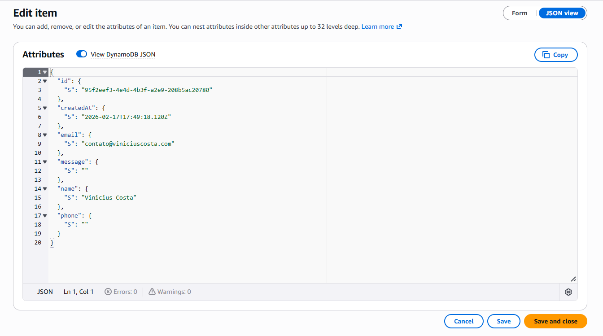
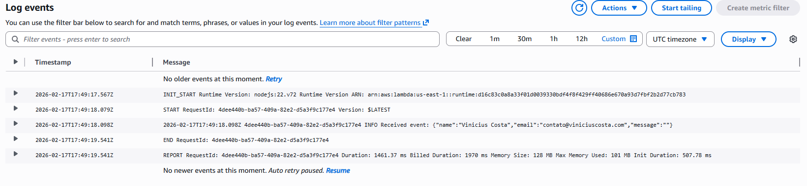
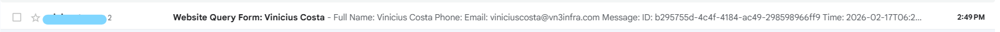
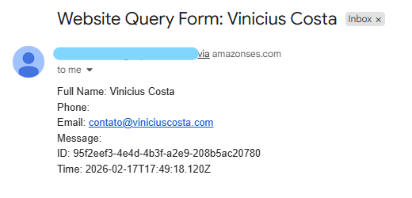

[🇧🇷 Versão em Português](#versao-em-portugues)

# Serverless Static Website & Lead Capture on AWS

A fully managed serverless architecture delivering static content via CloudFront and processing lead submissions using API Gateway, Lambda, DynamoDB, and SES

This project implements a scalable serverless architecture on AWS. Static assets are delivered through CloudFront from a private S3 origin, while form submissions are processed through API Gateway and AWS Lambda. Leads are persisted in DynamoDB and email notifications are sent via Amazon SES. Operational monitoring and cost controls are implemented using CloudWatch and AWS Budgets

## 📚 Documentation

- [Architecture Decision Records](./docs/adr/README.md)
- [Build Process](./docs/build-process/README.md)

## Architecture Diagram

## Demo

### Form Submission Flow

### DynamoDB Persistence

### CloudWatch Logs

### Owner Email

## Request Flow

1. User → DNS → CloudFront  
2. CloudFront → S3
3. Browser → API Gateway  
4. API Gateway → Lambda  
5. Lambda → DynamoDB  
6. Lambda → SES  
7. Lambda → CloudWatch  
8. CloudWatch → Alarm → SNS → Email  
9. AWS Budgets → Alert → Email

## AWS Services Used

- Amazon CloudFront
- Amazon S3
- Amazon API Gateway
- AWS Lambda
- Amazon DynamoDB
- Amazon SES
- Amazon CloudWatch
- Amazon SNS
- AWS Budgets
- AWS Certificate Manager

## Security & Hardening

- Private S3 bucket with CloudFront origin access control
- TLS termination via ACM
- CORS restricted to specific domains
- Input validation and sanitization
- Payload size limits
- API Gateway throttling
- Least-privilege IAM roles
- PII removed from logs
- Email masking for notifications

## Scalability

- Fully serverless architecture
- Automatic horizontal scaling
- Pay-per-use compute model
- API throttling controls
- Optional async processing: SQS-ready architecture

## Cost Management

- AWS Budgets alerts configured
- Free-tier conscious architecture
- No always-on compute resources
- Pay-per-request billing model

## Future Improvements

- Introduce SQS for async email processing
- Implement AWS WAF for advanced protection
- Add CI/CD pipeline
- Infrastructure as Code: AWS SAM / Terraform
- Add tracing with AWS X-Ray

## Author

Vinicius Costa  
Serverless Architecture Design February 2026

---

# 🇧🇷 Versão em Português

# Website Estático Serverless & Captura de Leads na AWS

Uma arquitetura serverless totalmente gerenciada que entrega conteúdo estático via CloudFront e processa submissões de leads utilizando API Gateway, Lambda, DynamoDB e SES.

Este projeto implementa uma arquitetura serverless escalável na AWS. Os arquivos estáticos são entregues através do CloudFront a partir de um bucket S3 privado, enquanto as submissões do formulário são processadas pelo API Gateway e AWS Lambda. Os leads são persistidos no DynamoDB e as notificações por e-mail são enviadas via Amazon SES. O monitoramento operacional e o controle de custos são implementados com CloudWatch e AWS Budgets.

## 📚 Documentação

- [Registros de Decisão de Arquitetura (ADR)](./docs/adr/README.md)
- [Processo de Build](./docs/build-process/README.md)

## Diagrama de Arquitetura

## Demonstração

### Fluxo de Submissão do Formulário

### Persistência no DynamoDB

### Logs no CloudWatch

### E-mail do Responsável

## Fluxo da Requisição

1. Usuário → DNS → CloudFront  
2. CloudFront → S3  
3. Navegador → API Gateway  
4. API Gateway → Lambda  
5. Lambda → DynamoDB  
6. Lambda → SES  
7. Lambda → CloudWatch  
8. CloudWatch → Alarme → SNS → E-mail  
9. AWS Budgets → Alerta → E-mail  

## Serviços AWS Utilizados

- Amazon CloudFront
- Amazon S3
- Amazon API Gateway
- AWS Lambda
- Amazon DynamoDB
- Amazon SES
- Amazon CloudWatch
- Amazon SNS
- AWS Budgets
- AWS Certificate Manager (ACM)

## Segurança & Hardening

- Bucket S3 privado com controle de acesso via CloudFront
- Terminação TLS via ACM
- CORS restrito a domínios específicos
- Validação e sanitização de entradas
- Limitação de tamanho de payload
- Throttling configurado no API Gateway
- Funções IAM com princípio do menor privilégio
- Remoção de PII dos logs
- Mascaramento de e-mail nas notificações

## Escalabilidade

- Arquitetura totalmente serverless
- Escalonamento horizontal automático
- Modelo de cobrança por uso
- Controle de taxa de requisições (throttling)
- Processamento assíncrono opcional: arquitetura preparada para SQS

## Gestão de Custos

- Alertas configurados no AWS Budgets
- Arquitetura pensada para o Free Tier
- Sem recursos de computação sempre ativos
- Modelo de cobrança por requisição

## Melhorias Futuras

- Introduzir SQS para processamento assíncrono de e-mails
- Implementar AWS WAF para proteção avançada
- Adicionar pipeline de CI/CD
- Infraestrutura como Código: AWS SAM / Terraform
- Adicionar rastreamento com AWS X-Ray

## Autor

Vinicius Costa  
Design de Arquitetura Serverless — Fevereiro 2026