[🇧🇷 Versão em Português](#versao-em-portugues)

### IMPORTANT: This project was developed in a controlled environment for educational and self-learning purposes. This project did not go through security or authentication criteria. Using this in a real production environment may expose the company to system vulnerabilities and cause financial and legal consequences in accordance with the General Data Protection Law (Lei Geral de Proteção de Dados) and the Brazilian Civil Rights Framework for the Internet (Marco Civil da Internet). This project must not be reproduced in a professional environment without first undergoing a thorough security validation and best practices review.

## In this section:
- [S3 bucket (static website hosting + permissions + AWS CLI upload)](#s3-bucket-static-website-hosting--permissions--aws-cli-upload)
- [Domain registration (Hostinger) + ACM certificate (CNAME validation)](#domain-registration-hostinger--acm-certificate-cname-validation)
- [CloudFront (HTTPS) + DNS routing + private S3 access](#cloudfront-https--dns-routing--private-s3-access)

## Section 01 - Static Hosting on AWS with HTTPS:


### S3 bucket (static website hosting + permissions + AWS CLI upload)

`aws s3 ls` - To list existing buckets

`aws s3 mb s3://MY_BUCKET` - To create the bucket. The name must be globally unique, so serialization may be necessary

I enabled static website hosting and configured the error and index files:

`aws s3api put-bucket-website --bucket MY_BUCKET --website-configuration '{"IndexDocument":{"Suffix":"index.html"},"ErrorDocument":{"Key":"error.html"}}'`

You can verify if it worked with:

`aws s3api get-bucket-website --bucket MY_BUCKET`

Or via console under properties:

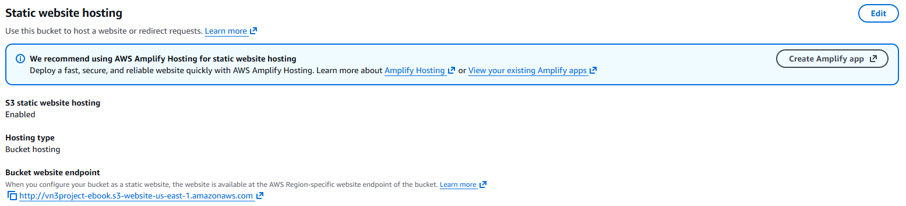

S3 is now active, but I haven't uploaded the files yet nor finished configuring access permissions. If we try to access the URL, we will receive a 403:


By default, S3 blocks public access. To disable the block, I ran:

`aws s3api put-public-access-block --bucket MY_BUCKET --public-access-block-configuration '{"BlockPublicAcls":false,"IgnorePublicAcls":false,"BlockPublicPolicy":false,"RestrictPublicBuckets":false}'`

I still needed to configure the S3 policies. For that:

`aws s3api put-bucket-policy --bucket MY_BUCKET --policy '{"Version":"2012-10-17","Statement":[{"Sid":"PublicReadGetObject","Effect":"Allow","Principal":"*","Action":["s3:GetObject"],"Resource":["arn:aws:s3:::MY_BUCKET/*"]}]}'`

Now the bucket is configured with public access. If we try accessing the URL again, the error changes to 404. Now we need to upload the files so S3 can find index.html and error.html.

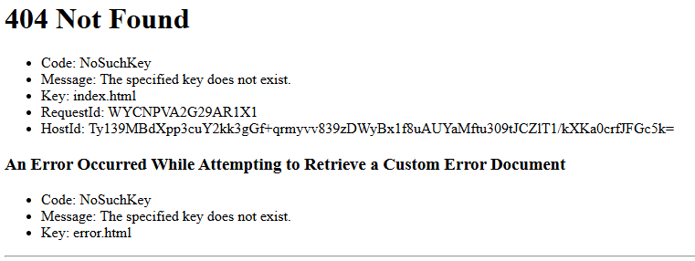

For that, I ran:

`aws s3 cp error.html s3://MY_BUCKET`

When accessing the page, I can now see the error HTML:


With the error page working, I uploaded the website files using:

`aws s3 sync . s3://MY_BUCKET` - Replace "." with the app directory if you are not already inside it

If everything worked correctly, the site should now be live:


### Domain registration (Hostinger) + ACM certificate (CNAME validation)

The website is currently using the HTTP protocol. One of the requirements is to use HTTPS. For that, I need a public certificate from AWS.

I will need a domain. I could not use Route 53 because it is not included in the AWS free tier. Therefore, I registered a domain on Hostinger.

With the domain registered, I went to ACM and requested a certificate:


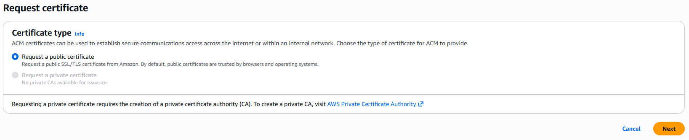

I added the Hostinger domain, including one with www:

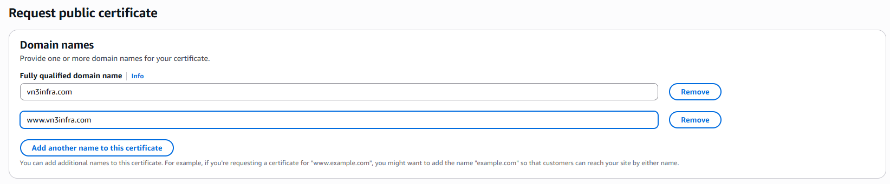

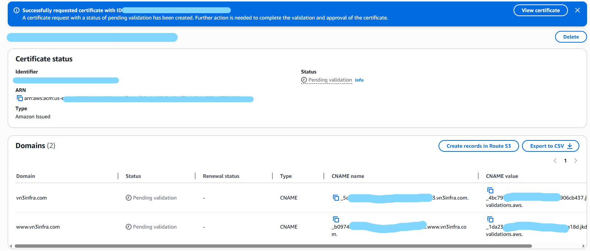

Now I need to confirm domain ownership. To do that, I must create a CNAME record in the Hostinger panel for each domain I requested.

I used the same name and target value that AWS displayed in the console:

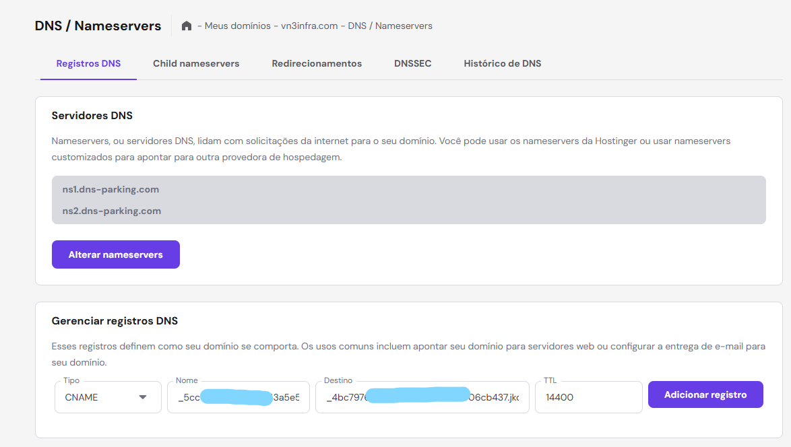

In the AWS console, we must wait for DNS propagation for validation. It should take around 10 minutes:


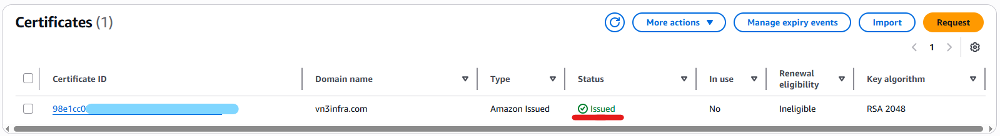


### CloudFront (HTTPS) + DNS routing + private S3 access

With the certificate validated, I configured CloudFront to make the S3 bucket private and route traffic properly. On the CloudFront page, I created a new distribution:

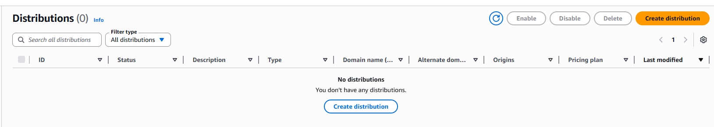

I selected the S3 bucket we created and continued. I did not use the website endpoint, since I will make the bucket private once DNS is pointing to CloudFront.

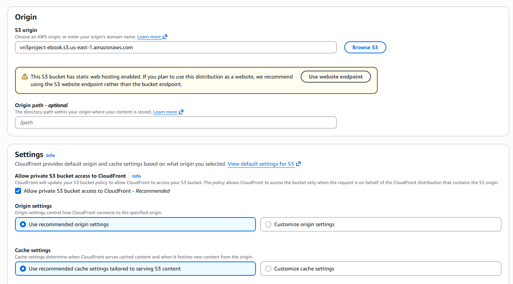

After creation, go to general settings and edit:

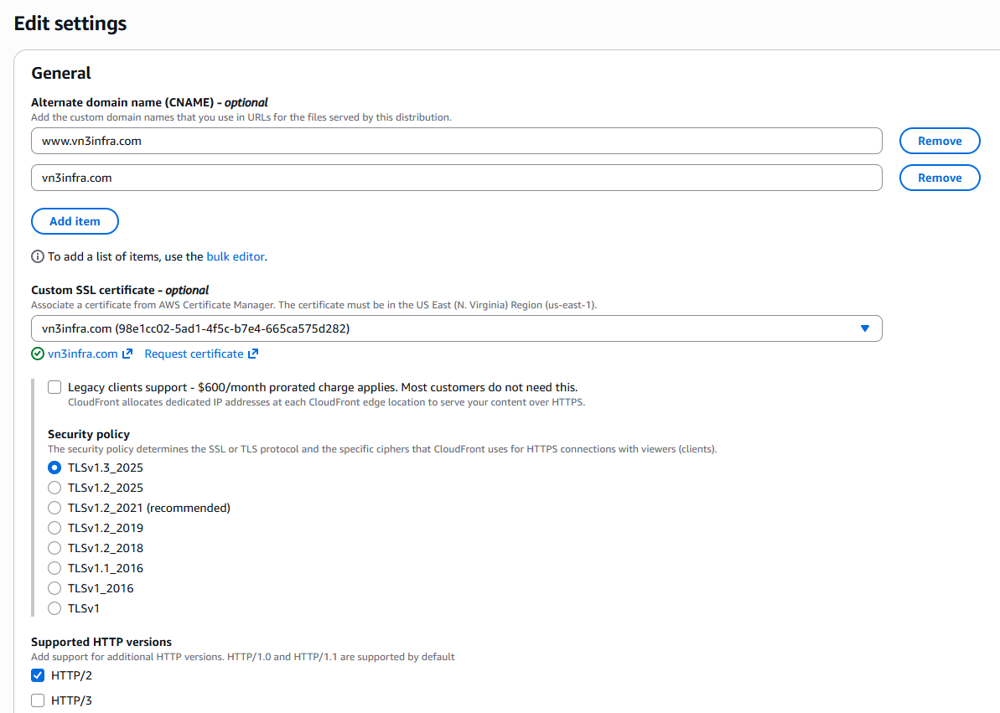

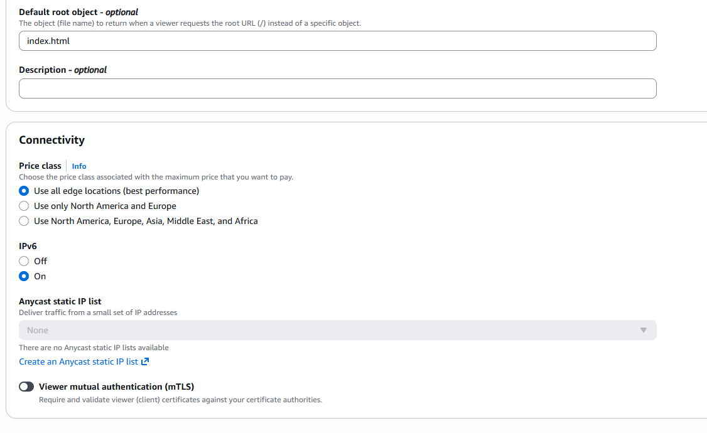

Now we need to point the domain to CloudFront. In Hostinger, I created two new DNS records:

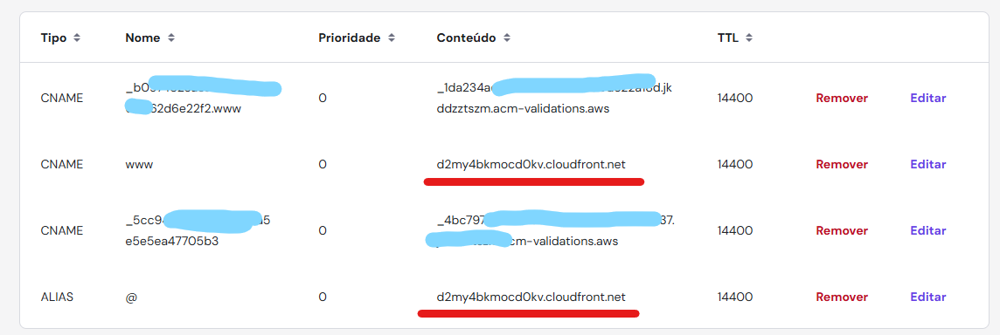

Now we wait for DNS propagation... We can check in the console using `nslookup DOMAIN` to verify if the IP has updated.

After confirming that the domain was working, I proceeded to make the bucket private, allowing access only through CloudFront.

In the AWS console, I went to the bucket under permissions. I blocked public access and updated the policies to allow only CloudFront:

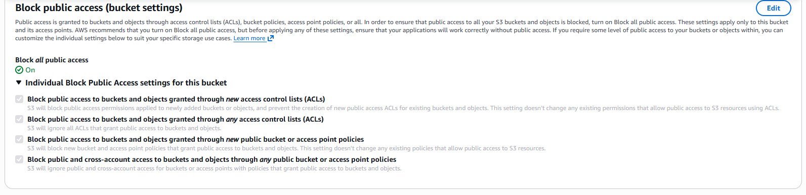

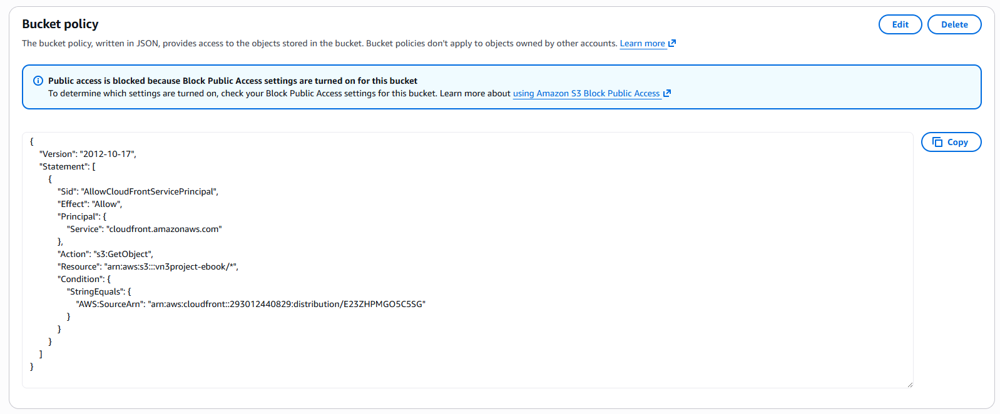

```json
{
    "Version": "2012-10-17",
    "Statement": [
        {
            "Sid": "AllowCloudFrontServicePrincipal",
            "Effect": "Allow",
            "Principal": {
                "Service": "cloudfront.amazonaws.com"
            },
            "Action": "s3:GetObject",
            "Resource": "arn:aws:s3:::vn3project-ebook/*",
            "Condition": {
                "StringEquals": {
                    "AWS:SourceArn": "arn:aws:cloudfront::293012440829:distribution/E23ZHPMGO5C5SG"
                }
            }
        }
    ]
}
```

Testing to confirm that direct bucket access returns 403:

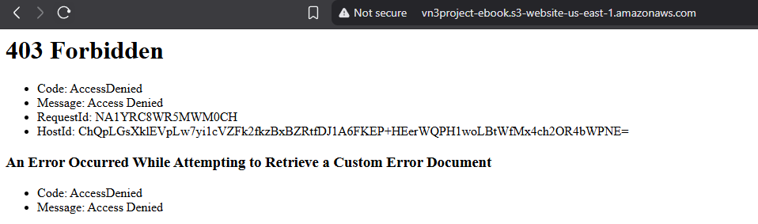

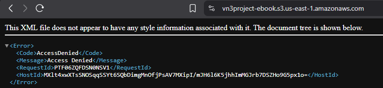

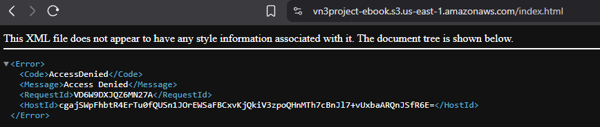

Finally, I disabled static website hosting since it is no longer being used:

`aws s3api delete-bucket-website --bucket vn3project-ebook`

You can confirm it was disabled with:

`aws s3api get-bucket-website --bucket vn3project-ebook` - It should return: An error occurred (NoSuchWebsiteConfiguration)

---

# 🇧🇷 Versão em Português

### IMPORTANTE: Esse projeto foi desenvolvido em um ambiente controlado com fins pedagógicos e de auto aprendizado. Esse projeto não passou por critérios de segurança ou autenticação. Usar isso em um ambiente de produção real pode expor a empresa a vulnerabilidades no sistema e causar consequências financeiras e legais de acordo com a Lei Geral de Proteção de Dados e o Marco Civil da Internet. Esse projeto não deve ser reproduzido em um ambiente profissional sem antes passar por uma validação minuciosa de segurança e boas práticas

## Nessa seção:
- [Bucket S3 (static website hosting + permissões + upload via AWS CLI)](#bucket-s3-static-website-hosting--permissões--upload-via-aws-cli)
- [Registro de domínio (Hostinger) + certificado ACM (validação via CNAME)](#registro-de-domínio-hostinger--certificado-acm-validação-via-cname)
- [CloudFront (HTTPS) + apontamento DNS + acesso privado ao S3](#cloudfront-https--apontamento-dns--acesso-privado-ao-s3)

## Seção 01 - Hosting Estatico na AWS com HTTPS:


### Bucket S3 (static website hosting + permissões + upload via AWS CLI)

`aws s3 ls` - Para ver os buckets ja existentes

`aws s3 mb s3://MEU_BUCKET` - Para criar o bucket. O nome precisa ser globalmente único, talvez seja necessário serializar

Ativei o website estatico e configurei os arquivos de erro e de index:

`aws s3api put-bucket-website --bucket MEU_BUCKET --website-configuration '{"IndexDocument":{"Suffix":"index.html"},"ErrorDocument":{"Key":"error.html"}}'`

Você pode conferir se deu certo via comando:

`aws s3api get-bucket-website --bucket MEU_BUCKET`

Ou, via console nas properties:


O s3 já esta ativo, mas ainda não mandei os arquivos e nem terminei as configurações de acesso. Se tentarmos acessar pela URL, receberemos um 403:


Por padrão, o s3 bloqueia o acesso publico. Para desativar o bloqueio, rodei:

`aws s3api put-public-access-block --bucket MEU_BUCKET --public-access-block-configuration '{"BlockPublicAcls":false,"IgnorePublicAcls":false,"BlockPublicPolicy":false,"RestrictPublicBuckets":false}'`

Ainda preciso configurar as politicas do s3. Para isso:

`aws s3api put-bucket-policy --bucket MEU_BUCKET --policy '{"Version":"2012-10-17","Statement":[{"Sid":"PublicReadGetObject","Effect":"Allow","Principal":"*","Action":["s3:GetObject"],"Resource":["arn:aws:s3:::MEU_BUCKET/*"]}]}'`

Agora o bucket esta configurado e com acesso público. Se tentar acessar pela URL o erro muda para 404. Agora precisamos subir os arquivos para o s3 encontrar o index.html e o error.html. 


Para isso, rodei:

`aws s3 cp error.html s3://MEU_BUCKET`

Ao acessar a pagina, ja consigo ver o html de erro:


Com a mensagem de erro funcionando, vou subir os arquivos do website usando:

`aws s3 sync . s3://MEU_BUCKET` - Troque "." pelo diretório do app, se já não estiver nele

Se tudo deu certo, o site já esta funcionando:


### Registro de domínio (Hostinger) + certificado ACM (validação via CNAME)

O website esta usando o protocolo HTTP. Um dos requisitos é utilizar HTTPS. Para isso, vou precisar de um certificado público da AWS

Vou precisar de um domínio. Eu não pude usar o Route 53 pois ele não esta incluso no free tier da AWS. Por isso, registrei um dominio na Hostinger

Com o dominio em mãos, fui até o ACM e fiz um request para conseguir o certificado:


Coloquei o dominio da Hostinger. Incluí um com www:


Agora preciso confirmar a posse do dominio. Para isso, preciso criar um CNAME no painel da Hostinger para cada dominio que fiz a request

Coloquei o mesmo nome e o apontamento que a AWS mostrou no console:


No console AWS, temos que esperar a propagação do DNS para validar. Deve demorar uns 10 minutos:


### CloudFront (HTTPS) + apontamento DNS + acesso privado ao S3

Com o certificado validado, vamos configurar o CloudFront para poder privar o s3 e direcionar o tráfego. Na pagina do CloudFront, criei uma nova distribuição:


Selecionei o s3 que criamos e prossegui. Não usei website endpoint, vou deixar o bucket privado assim que o DNS estiver apontando para o CloudFront


Depois de criado, vá em general e edite as settings:


Agora precisamos fazer o dominio apontar para o CloudFront. Na hostinger, criei dois novos registros:


Agora aguardar até o DNS propagar... Podemos checar no console com `nslookup DOMINIO` para ver se o ip ja atualizou

Confirmei que o dominio estava funcionando e prossegui deixando o bucket privado para permitir o acesso apenas pelo CloudFront

No console AWS, fui no meu bucket e em permissions. Bloqueei o acesso público e alterei as politicas para permitir apenas o CloudFront:


```json
{
    "Version": "2012-10-17",
    "Statement": [
        {
            "Sid": "AllowCloudFrontServicePrincipal",
            "Effect": "Allow",
            "Principal": {
                "Service": "cloudfront.amazonaws.com"
            },
            "Action": "s3:GetObject",
            "Resource": "arn:aws:s3:::vn3project-ebook/*",
            "Condition": {
                "StringEquals": {
                    "AWS:SourceArn": "arn:aws:cloudfront::293012440829:distribution/E23ZHPMGO5C5SG"
                }
            }
        }
    ]
}
```

Testando para ver se o acesso direto ao bucket retorna 403:


Para finalizar, desativei o static website ja que não estamos mais utilizando:

`aws s3api delete-bucket-website --bucket vn3project-ebook`

Pode confirmar que desativou com:

`aws s3api get-bucket-website --bucket vn3project-ebook` - Deve retornar: `An error occurred (NoSuchWebsiteConfiguration)`