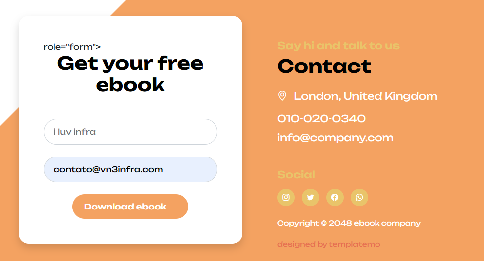
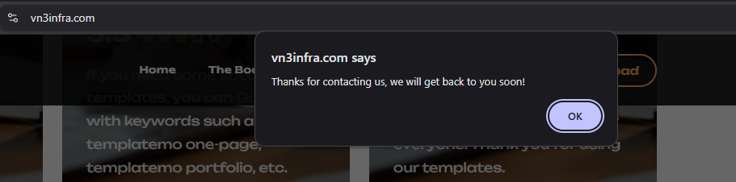
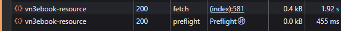
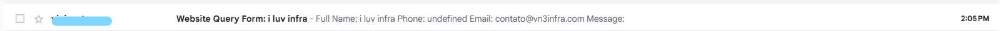
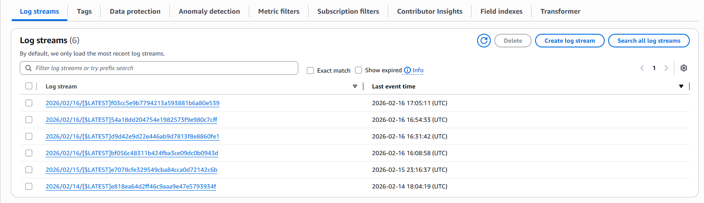

[🇧🇷 Versão em Português](#-versão-em-português)

### IMPORTANT: This project was developed in a controlled environment for educational and self-learning purposes. This project did not go through security or authentication criteria. Using this in a real production environment may expose the company to system vulnerabilities and cause financial and legal consequences in accordance with the General Data Protection Law (Lei Geral de Proteção de Dados) and the Brazilian Civil Rights Framework for the Internet (Marco Civil da Internet). This project must not be reproduced in a professional environment without first undergoing a thorough security validation and best practices review.

## In this section:
- [Email identities in SES](#email-identities-in-ses)
- [IAM Policy + Role (CloudWatch Logs + SES)](#iam-policy--role-cloudwatch-logs--ses)
- [Lambda Node.js (form handling + email sending)](#lambda-nodejs-form-handling--email-sending)
- [REST API in API Gateway (CORS + curl tests)](#rest-api-in-api-gateway-cors--curl-tests)
- [Frontend integration via fetch (POST)](#frontend-integration-via-fetch-post)
- [Deploy to S3 + CloudFront invalidation + domain validation](#deploy-to-s3--cloudfront-invalidation--domain-validation)

## Section 02 - Capturing email and name:


### Email identities in SES

I created two new identities in SES using email addresses


### IAM Policy + Role (CloudWatch Logs + SES)

Next, I created the policy that the Lambda role would use. For that, I went to IAM and created a new JSON policy:

```json
{
  "Version": "2012-10-17",
  "Statement": [
    {
      "Sid": "CloudWatchLogsBasic",
      "Effect": "Allow",
      "Action": ["logs:CreateLogGroup"],
      "Resource": "*"
    },
    {
      "Sid": "CloudWatchLogsStreamEvents",
      "Effect": "Allow",
      "Action": ["logs:CreateLogStream","logs:PutLogEvents"],
      "Resource": "*"
    },
    {
      "Sid": "AllowSesSendEmail",
      "Effect": "Allow",
      "Action": ["ses:SendEmail","ses:SendRawEmail"],
      "Resource": "*"
    }
  ]
}
```

The statements allow Lambda to create logs in CloudWatch and use SES. After creating it, I attached the policy to a new IAM role:


With the role configured, it was time to create the function in Lambda:


### Lambda Node.js (form handling + email sending)

The app runs in Node.js, so I selected it as the runtime language. I adjusted the permissions to include the new role we created. After creating it, I went to the code source and added the function:

```ts
import { SESClient, SendEmailCommand } from "@aws-sdk/client-ses";

const ses = new SESClient({ region: "us-east-1" });

const RECEIVER = "EMAIL-TO-RECEIVE";
const SENDER = "EMAIL-TO-SEND";

export const handler = async (event) => {
 console.log("Received event:", event);

 const params = {
   Destination: { ToAddresses: [RECEIVER] },
   Message: {
     Body: {
       Text: {
         Data: `Full Name: ${event.name}
Phone: ${event.phone}
Email: ${event.email}
Message: ${event.message}`,
         Charset: "UTF-8",
       },
     },
     Subject: { Data: `Website Query Form: ${event.name}`, Charset: "UTF-8" },
   },
   Source: SENDER,
 };

 await ses.send(new SendEmailCommand(params));

 return {
   statusCode: 200,
   headers: {
     "Content-Type": "application/json",
     "Access-Control-Allow-Origin": "*",
   },
   body: JSON.stringify({ result: "Success" }),
 };
};
```


### IMPORTANT: This code is only for my lab in a controlled learning environment. The code has NO security or validation and MUST NOT be used in real environments.

Reminder:
  1. `const ses = new SESClient({ region: "us-east-1" });` – Select the same region where SES is configured
  2. `const RECEIVER = "EMAIL-TO-RECEIVE";`
     `const SENDER = "EMAIL-TO-SEND";`
      Replace with valid emails

I deployed the code and tested it by creating an event with dummy data:


If everything worked correctly, we should receive an email with the captured test data:


### REST API in API Gateway (CORS + curl tests)

With Lambda working, I proceeded to create the API. I created a REST API in API Gateway:


I created a resource and then a method:


I enabled CORS and deployed the API:


I tested the API to verify it returned 200 in the CLI. Remember to replace the API URL:

`curl -i -X POST "https://xxxxxxxxxxx.execute-api.us-east-1.amazonaws.com/dev/vn3ebook-resource" -H "Origin: https://your-site-domain.com" -H "Content-Type: application/json" -d '{"name":"Vinicius Costa","phone":"+55123456789","email":"user@example.com","message":"Hello from curl"}'`

Success!


Checking CloudWatch, the logs are already being recorded:


### Frontend integration via fetch (POST)

Now I connected the frontend to the API Gateway. We needed to make some changes to our template since we previously did not allow POST through CloudFront and S3 does not support non-static POST methods. In the contact-form:


`<form id="contact-form" class="custom-form ebook-download-form bg-white shadow" role="form">`

In the scripts section, I added a new script to call the API. It sends the POST request to API Gateway and returns a success or error message to the client:

```ts
  <script>     
      (function () {
          const URL = "https://xxxxxxxxxxx.execute-api.us-east-1.amazonaws.com/dev/resource-name";

          const form = document.getElementById("contact-form");
          if (!form) {
              console.error("contact-form not found in DOM");
              return;
          }

          form.addEventListener("submit", async function (e) {
              e.preventDefault();

              const name = document.getElementById("ebook-form-name")?.value || "";
              const email = document.getElementById("ebook-email")?.value || "";
              const messageEl = document.getElementById("ebook-message");
              const message = messageEl ? messageEl.value : "";

              try {
                  const resp = await fetch(URL, {
                      method: "POST",
                      headers: { "Content-Type": "application/json", "Accept": "application/json" },
                      body: JSON.stringify({ name, email, message }),
                  });

                  const contentType = resp.headers.get("content-type") || "";
                  let bodyText = "";
                  try { bodyText = await resp.text(); } catch { }

                  console.log("API status:", resp.status);
                  console.log("API headers:", Object.fromEntries(resp.headers.entries()));
                  console.log("API body:", bodyText);

                  if (!resp.ok) {
                      throw new Error(`HTTP ${resp.status} - ${bodyText || "No body"}`);
                  }

                  alert("Thanks for contacting us, we will get back to you soon!");
                  this.reset();
              } catch (err) {
                  console.error("Request failed:", err);
                  alert("Something went wrong. Please try again.");
              }
          });
      })();
  </script>
```

Testing index.html:


After submitting, we receive the success message:


To confirm our API worked and the endpoint is correct, we should have received an email with the user data:


### Deploy to S3 + CloudFront invalidation + domain validation

Success! Now I can upload the files to S3:

`aws s3 sync . s3://MY_BUCKET` – Replace "." with the app directory if you are not already inside it

Before testing, we need to invalidate the CloudFront cache so it refreshes the S3 origin. Without invalidation, we would need to wait for the TTL to expire to refresh the CDN cache. I went to CloudFront and created an invalidation:


Just wait a few seconds and the cache will be updated...

Testing now at vn3infra.com:









To finalize the tests, I checked our logs in CloudWatch:



Everything working perfectly!

---

# 🇧🇷 Versão em Português

### IMPORTANTE: Esse projeto foi desenvolvido em um ambiente controlado com fins pedagógicos e de auto aprendizado. Esse projeto não passou por critérios de segurança ou autenticação. Usar isso em um ambiente de produção real pode expor a empresa a vulnerabilidades no sistema e causar consequências financeiras e legais de acordo com a Lei Geral de Proteção de Dados e o Marco Civil da Internet. Esse projeto não deve ser reproduzido em um ambiente profissional sem antes passar por uma validação minuciosa de segurança e boas práticas

## Nessa seção:
- [Identidades de e-mail no SES](#identidades-de-e-mail-no-ses)
- [IAM Policy + Role (CloudWatch Logs + SES)](#iam-policy--role-cloudwatch-logs--ses)
- [Lambda Node.js (recebimento do formulário + envio de e-mail)](#lambda-nodejs-recebimento-do-formulário--envio-de-e-mail)
- [REST API no API Gateway (CORS + testes com curl)](#rest-api-no-api-gateway-cors--testes-com-curl)
- [Integração do frontend via fetch (POST)](#integração-do-frontend-via-fetch-post)
- [Deploy no S3 + Invalidation no CloudFront + validação via domínio](#deploy-no-s3--invalidation-no-cloudfront--validação-via-domínio)

## Seção 02 - Captura de email e nome:


### Identidades de e-mail no SES

Criei duas novas identidades no SES usando endereços de e-mail


### IAM Policy + Role (CloudWatch Logs + SES)

Prossegui para criar a politica que a role do Lambda vai usar. Para isso, fui em IAM e criei uma nova politica em JSON:

```json
{
  "Version": "2012-10-17",
  "Statement": [
    {
      "Sid": "CloudWatchLogsBasic",
      "Effect": "Allow",
      "Action": ["logs:CreateLogGroup"],
      "Resource": "*"
    },
    {
      "Sid": "CloudWatchLogsStreamEvents",
      "Effect": "Allow",
      "Action": ["logs:CreateLogStream","logs:PutLogEvents"],
      "Resource": "*"
    },
    {
      "Sid": "AllowSesSendEmail",
      "Effect": "Allow",
      "Action": ["ses:SendEmail","ses:SendRawEmail"],
      "Resource": "*"
    }
  ]
}
```

Os statements vão permitir que o Lambda crie o log no CloudWatch e use o SES. Depois de criada, atribuí a politica em uma nova role no IAM:


Com a role configurada, hora de criar a function no Lambda:


### Lambda Node.js (recebimento do formulário + envio de e-mail)

O app roda em Node.js, então selecionei ela como linguagem no runtime. Ajeitei as permissões para incluir a nova role que criamos. Assim que criei, fui até o code source e coloquei a function:

```ts
import { SESClient, SendEmailCommand } from "@aws-sdk/client-ses";

const ses = new SESClient({ region: "us-east-1" });

const RECEIVER = "EMAIL-QUE-VAI-RECEBER";
const SENDER = "EMAIL-QUE-VAI-MANDAR";

export const handler = async (event) => {
 console.log("Received event:", event);

 const params = {
   Destination: { ToAddresses: [RECEIVER] },
   Message: {
     Body: {
       Text: {
         Data: `Full Name: ${event.name}
Phone: ${event.phone}
Email: ${event.email}
Message: ${event.message}`,
         Charset: "UTF-8",
       },
     },
     Subject: { Data: `Website Query Form: ${event.name}`, Charset: "UTF-8" },
   },
   Source: SENDER,
 };

 await ses.send(new SendEmailCommand(params));

 return {
   statusCode: 200,
   headers: {
     "Content-Type": "application/json",
     "Access-Control-Allow-Origin": "*",
   },
   body: JSON.stringify({ result: "Success" }),
 };
};
```


### IMPORTANTE: Esse código é apenas para meu lab em um ambiente controlado de aprendizado. O código NÃO tem segurança e nem validação e NÃO deve ser usado em ambientes reais.

Lembrete:
  1. `const ses = new SESClient({ region: "us-east-1" });` - Selecionar a mesma região onde o SES esta configurado
  2.  `const RECEIVER = "EMAIL-QUE-VAI-RECEBER";`
      `const SENDER = "EMAIL-QUE-VAI-MANDAR";`
      Trocar por emails válidos

Dei deploy no codigo e testei criando um evento com dados imaginários:


Se tudo deu certo, vamos receber um email com os dados capturados no teste:


### REST API no API Gateway (CORS + testes com curl)

Com o Lambda funcionando, prossegui para criar a API. Criei uma REST API no API Gateway:


Criei um resource e depois um metodo:


Ativei o CORS e dei deploy na API:


Testei a API para ver se retornava 200 no CLI, lembre de trocar a URL da API:

`curl -i -X POST "https://xxxxxxxxxxx.execute-api.us-east-1.amazonaws.com/dev/vn3ebook-resource" -H "Origin: https://your-site-domain.com" -H "Content-Type: application/json" -d '{"name":"Vinicius Costa","phone":"+55123456789","email":"user@example.com","message":"Hello from curl"}'`

Sucesso!


Conferindo no CloudWatch os logs ja estão sendo registrados:


### Integração do frontend via fetch (POST)

Agora, vou fazer o frontend se conectar com o API gateway. Precisamos fazer algumas mudanças no nosso template, já que não permitimos post no CloudFront anteriormente e o s3 não suporta esse método não estatico. No contact-form:


`<form id="contact-form" class="custom-form ebook-download-form bg-white shadow" role="form">`

Na parte de scripts, adicionei um novo script para chamar a API. Ela faz o post no API Gateway e devolve uma mensagem de sucesso ou erro para o cliente

```ts
  <script>     
      (function () {
           const URL = "https://xxxxxxxxxxx.execute-api.us-east-1.amazonaws.com/dev/resource-name";


           const form = document.getElementById('contact-form');
           if (!form) {
               console.error("contact-form not found in DOM");
               return;
           }


           form.addEventListener('submit', async function (e) {
               e.preventDefault();


               const name = document.getElementById('ebook-form-name')?.value || "";
               const email = document.getElementById('ebook-email')?.value || "";
               const messageEl = document.getElementById('ebook-message'); // optional field
               const message = messageEl ? messageEl.value : "";


               try {
                   const resp = await fetch(URL, {
                       method: 'POST',
                       headers: { 'Content-Type': 'application/json', 'Accept': 'application/json' },
                       body: JSON.stringify({ name, email, message }),
                       // mode: 'cors' // not required, but harmless if you want to make it explicit
                   });


                   const contentType = resp.headers.get('content-type') || '';
                   let bodyText = '';
                   try { bodyText = await resp.text(); } catch { }


                   console.log('API status:', resp.status);
                   console.log('API headers:', Object.fromEntries(resp.headers.entries()));
                   console.log('API body:', bodyText);


                   if (!resp.ok) {
                       throw new Error(`HTTP ${resp.status} - ${bodyText || 'No body'}`);
                   }


                   alert("Thanks for contacting us, we will get back to you soon!");
                   this.reset();
               } catch (err) {
                   console.error("Request failed:", err);
                   alert("Something went wrong. Please try again.");
               }
           });
       })();
   </script>
```

Testando o index.html:


Enviando, recebemos a mensagem de sucesso:


Para confirmar que nossa API funcionou e a chave esta correta, devemos ter recebido um e-mail com os dados do usuário:


### Deploy no S3 + Invalidation no CloudFront + validação via domínio

Sucesso! Agora posso subir os arquivos para o s3:

`aws s3 sync . s3://MEU_BUCKET` - Troque "." pelo diretório do app, se já não estiver nele

Antes de testar, precisamos invalidar o cache no CloudFront para ele atualizar o origin s3. Sem invalidar, teriamos que esperar até o TTL acabar para atualizar o cache da CDN. Fui em CloudFront e criei uma invalidation:


Só esperar alguns segundos e o cache vai ser atualizado...

Testando agora em vn3infra.com:


Para finalizar os testes, conferi nossos logs no CloudWatch:


Tudo funcionando perfeitamente!