Com o s3, CloudFront e DNS configurados, vou começar a fazer a captura dos dados do cliente. No caso, email e nome.

## Passo 02 - Captura de email e nome:

Criei duas novas identidades no SES usando endereços de e-mail

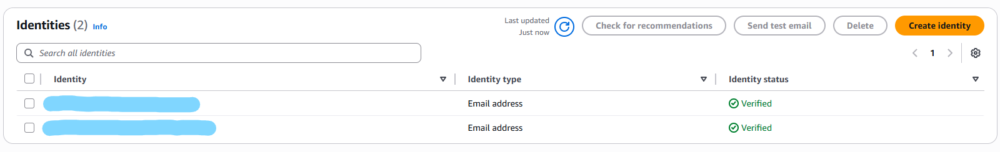

Prossegui para criar a politica que a role do Lambda vai usar. Para isso, fui em IAM e criei uma nova politica em JSON:

```
{
  "Version": "2012-10-17",
  "Statement": [
    {
      "Sid": "CloudWatchLogsBasic",
      "Effect": "Allow",
      "Action": ["logs:CreateLogGroup"],
      "Resource": "*"
    },
    {
      "Sid": "CloudWatchLogsStreamEvents",
      "Effect": "Allow",
      "Action": ["logs:CreateLogStream","logs:PutLogEvents"],
      "Resource": "*"
    },
    {
      "Sid": "AllowSesSendEmail",
      "Effect": "Allow",
      "Action": ["ses:SendEmail","ses:SendRawEmail"],
      "Resource": "*"
    }
  ]
}
```

Os statements vão permitir que o Lambda crie o log no CloudWatch e use o SES. Depois de criada, atribuí a politica em uma nova role no IAM:

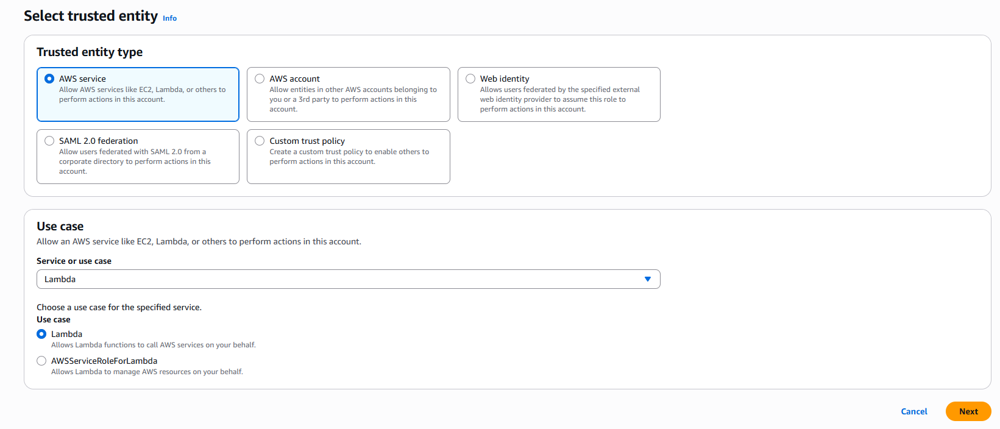

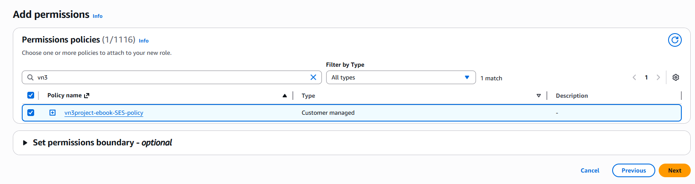

Com a role configurada, hora de criar a function no Lambda:

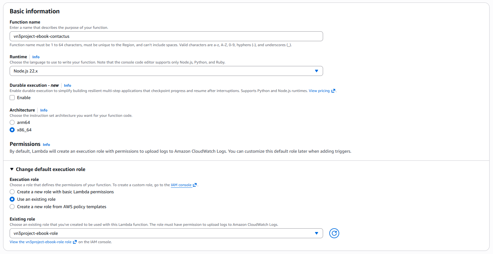

O app roda em Node.js, então selecionei ela como linguagem no runtime. Ajeitei as permissões para incluir a nova role que criamos. Assim que criei, fui até o code source e coloquei a function:

```
import { SESClient, SendEmailCommand } from "@aws-sdk/client-ses";


const ses = new SESClient({ region: "us-east-1" });


const RECEIVER = "EMAIL-QUE-VAI-RECEBER";
const SENDER = "EMAIL-QUE-VAI-MANDAR";


export const handler = async (event) => {
 console.log("Received event:", event);


 const params = {
   Destination: { ToAddresses: [RECEIVER] },
   Message: {
     Body: {
       Text: {
         Data: `Full Name: ${event.name}
Phone: ${event.phone}
Email: ${event.email}
Message: ${event.message}`,
         Charset: "UTF-8",
       },
     },
     Subject: { Data: `Website Query Form: ${event.name}`, Charset: "UTF-8" },
   },
   Source: SENDER,
 };


 await ses.send(new SendEmailCommand(params));


 return {
   statusCode: 200,
   headers: {
     "Content-Type": "application/json",
     "Access-Control-Allow-Origin": "*",
   },
   body: JSON.stringify({ result: "Success" }),
 };
};
```

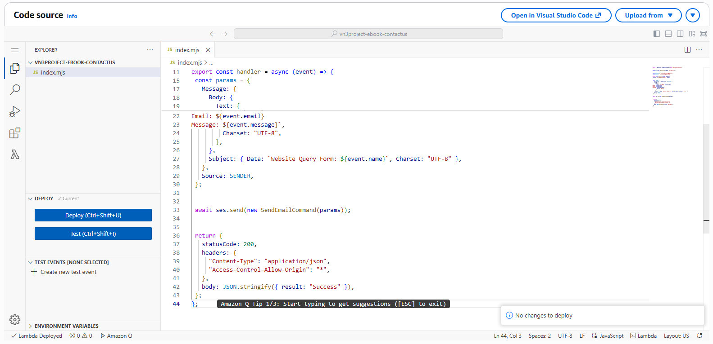

## IMPORTANTE: Esse código é apenas para meu lab em um ambiente controlado de aprendizado. O código NÃO tem segurança e nem validação e NÃO deve ser usado em ambientes reais.

Lembrete:
    1. `const ses = new SESClient({ region: "us-east-1" });` - Selecionar a mesma região onde o SES esta configurado
    2.  `const RECEIVER = "EMAIL-QUE-VAI-RECEBER";`
        `const SENDER = "EMAIL-QUE-VAI-MANDAR";`
        Trocar por emails válidos

Dei deploy no codigo e testei criando um evento com dados imaginários:

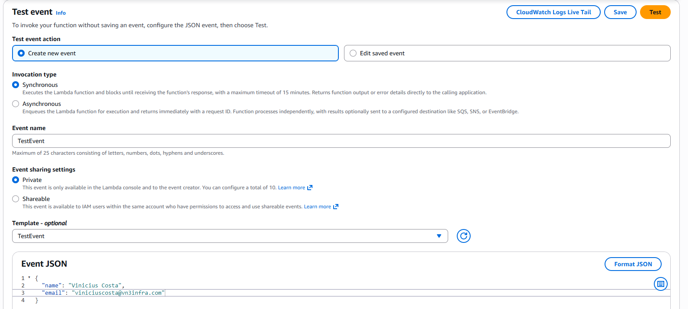

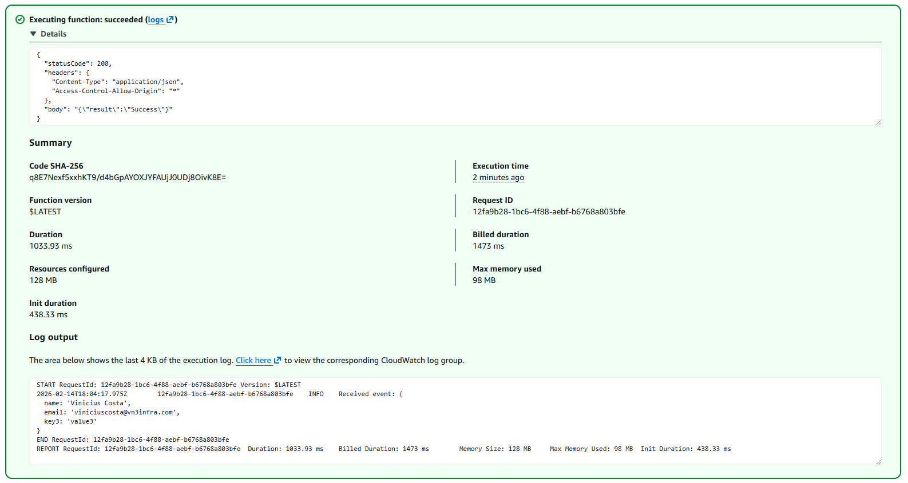

Se tudo deu certo, vamos receber um email com os dados capturados no teste:

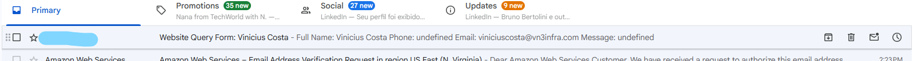

Com o Lambda funcionando, prossegui para criar a API. Criei uma REST API no API Gateway:

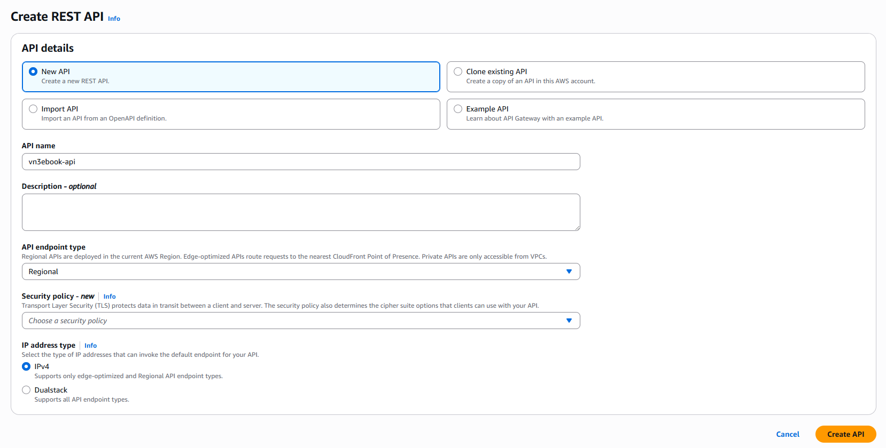

Criei um resource e depois um metodo:

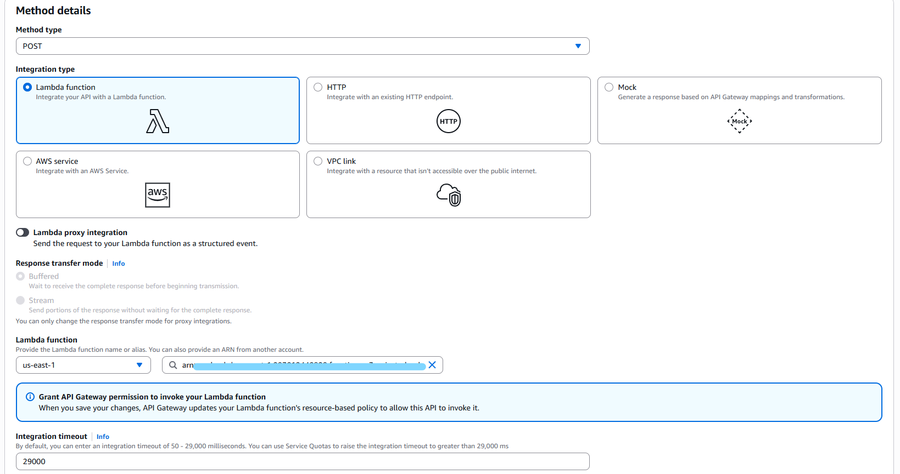

Ativei o CORS e dei deploy na API:

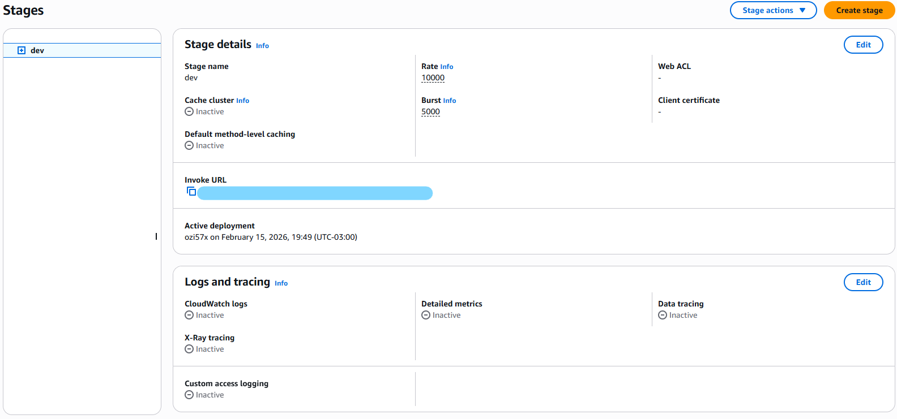

Testei a API para ver se retornava 200 no CLI, lembre de trocar a URL da API:

`curl -i -X POST "https://xxxxxxxxxxx.execute-api.us-east-1.amazonaws.com/dev/vn3ebook-resource" -H "Origin: https://your-site-domain.com" -H "Content-Type: application/json" -d '{"name":"Vinicius Costa","phone":"+55123456789","email":"user@example.com","message":"Hello from curl"}'`

Sucesso!

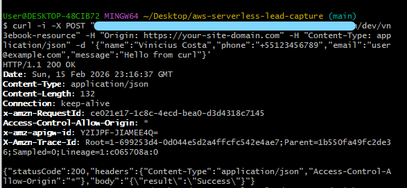

Conferindo no CloudWatch os logs ja estão sendo registrados:

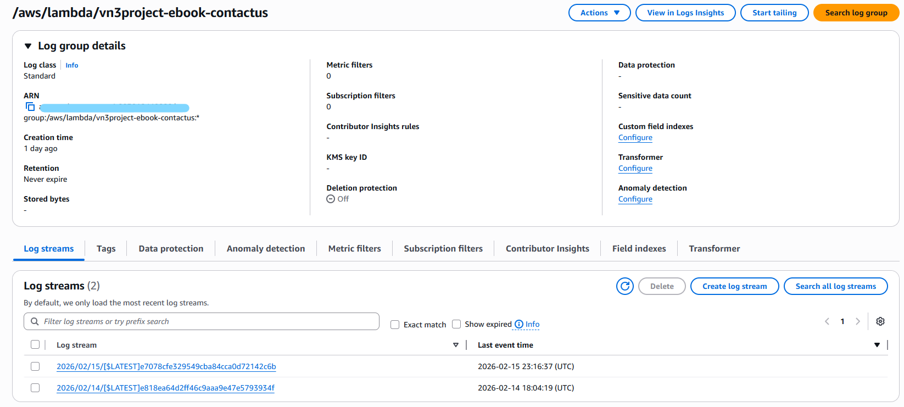

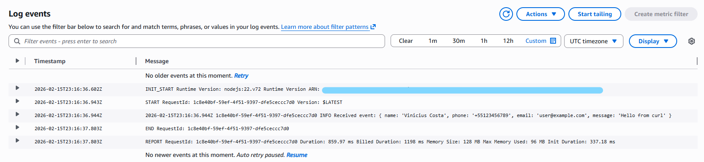

Agora, vou fazer o frontend se conectar com o API gateway. Precisamos fazer algumas mudanças no nosso template, já que não permitimos post no CloudFront anteriormente e o s3 não suporta esse método não estatico. No contact-form:

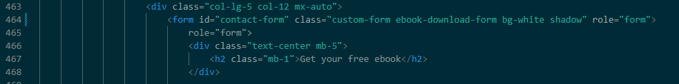

`<form id="contact-form" class="custom-form ebook-download-form bg-white shadow" role="form">`

Na parte de scripts, adicionei um novo script para chamar a API. Ela faz o post no API Gateway e devolve uma mensagem de sucesso ou erro para o cliente

```
  <script>     
      (function () {
           const URL = "https://xxxxxxxxxxx.execute-api.eu-north-1.amazonaws.com/dev/resource-name";


           const form = document.getElementById('contact-form');
           if (!form) {
               console.error("contact-form not found in DOM");
               return;
           }


           form.addEventListener('submit', async function (e) {
               e.preventDefault();


               const name = document.getElementById('ebook-form-name')?.value || "";
               const email = document.getElementById('ebook-email')?.value || "";
               const messageEl = document.getElementById('ebook-message'); // optional field
               const message = messageEl ? messageEl.value : "";


               try {
                   const resp = await fetch(URL, {
                       method: 'POST',
                       headers: { 'Content-Type': 'application/json', 'Accept': 'application/json' },
                       body: JSON.stringify({ name, email, message }),
                       // mode: 'cors' // not required, but harmless if you want to make it explicit
                   });


                   const contentType = resp.headers.get('content-type') || '';
                   let bodyText = '';
                   try { bodyText = await resp.text(); } catch { }


                   console.log('API status:', resp.status);
                   console.log('API headers:', Object.fromEntries(resp.headers.entries()));
                   console.log('API body:', bodyText);


                   if (!resp.ok) {
                       throw new Error(`HTTP ${resp.status} - ${bodyText || 'No body'}`);
                   }


                   alert("Thanks for contacting us, we will get back to you soon!");
                   this.reset();
               } catch (err) {
                   console.error("Request failed:", err);
                   alert("Something went wrong. Please try again.");
               }
           });
       })();
   </script>
```

## IMPORTANTE: A API não passou por critérios de segurança ou autenticação. Usar isso em um ambiente de produção real pode expor a empresa a vulnerabilidades no sistema e causar consequências financeiras e legais de acordo com a Lei Geral de Proteção de Dados e o Marco Civil da Internet. Esse projeto tem fins pedagógicos e de auto aprendizado: Não deve ser reproduzido em um ambiente profissional sem antes passar por uma validação minuciosa de segurança e boas práticas

Testando o index.html:

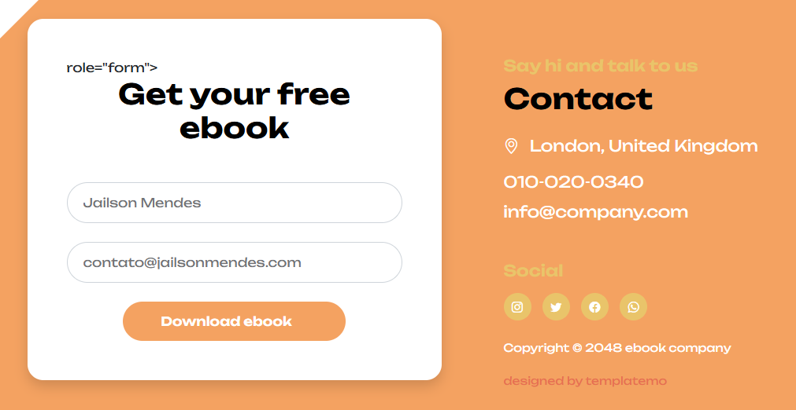

Enviando, recebemos a mensagem de sucesso:

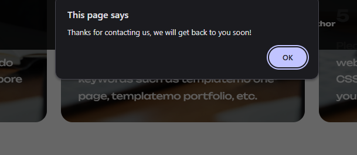

Para confirmar que nossa API funcionou e a chave esta correta, devemos ter recebido um e-mail com os dados do usuário:

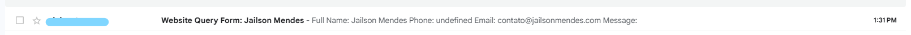

Sucesso! Agora posso subir os arquivos para o s3:

`aws s3 sync . s3://MEU_BUCKET` - Troque "." pelo diretório do app, se já não estiver nele

Antes de testar, precisamos invalidar o cache no CloudFront para ele atualizar o origin s3. Sem invalidar, teriamos que esperar até o TTL acabar para atualizar o cache da CDN. Fui em CloudFront e criei uma invalidation:

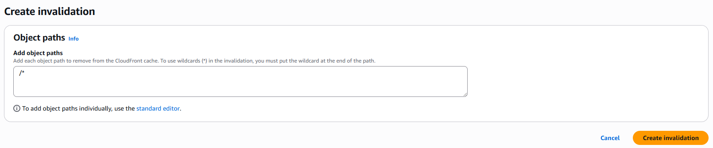

Só esperar alguns segundos e o cache vai ser atualizado...