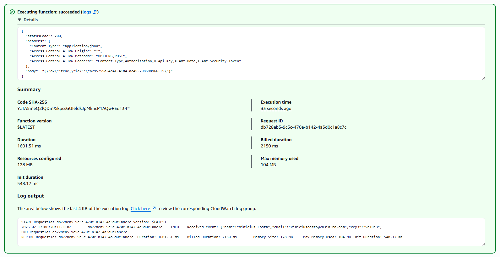
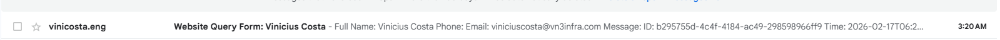
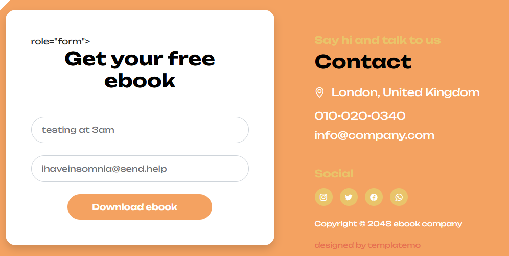
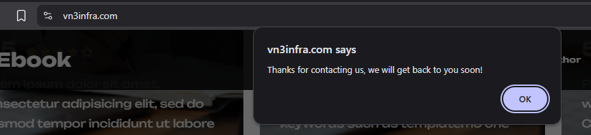
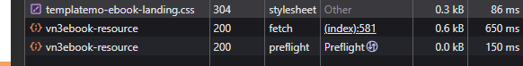
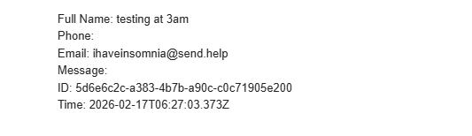
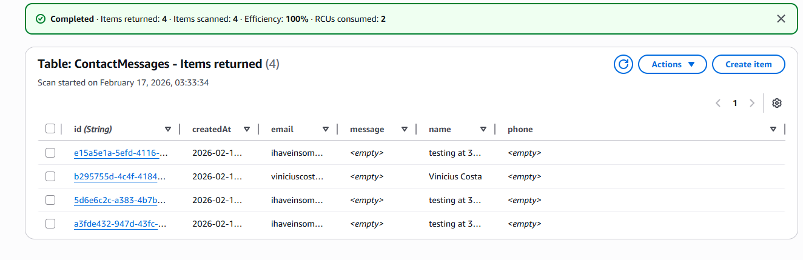

### IMPORTANTE: Esse projeto foi desenvolvido em um ambiente controlado com fins pedagógicos e de auto aprendizado. Esse projeto não passou por critérios de segurança ou autenticação. Usar isso em um ambiente de produção real pode expor a empresa a vulnerabilidades no sistema e causar consequências financeiras e legais de acordo com a Lei Geral de Proteção de Dados e o Marco Civil da Internet. Esse projeto não deve ser reproduzido em um ambiente profissional sem antes passar por uma validação minuciosa de segurança e boas práticas

## Nessa seção:
- Fiz a tabela ContactMessages no DynamoDB via AWS CLI
- Percebi que a role do Lambda não tinha permissão no DynamoDB e adicionei uma inline policy com dynamodb:PutItem
- Atualizei o Lambda pra salvar a mensagem no DynamoDB e enviar e-mail via SES, com validação básica e CORS
- Dei deploy e testei no console e no meu domínio: e-mail chegou e os itens apareceram na tabela

## Seção 03 - Configurando DynamoDB

Vou começar criando a table. Para isso usei o AWS CLI:

`aws dynamodb create-table --table-name ContactMessages --attribute-definitions AttributeName=id,AttributeType=S --key-schema AttributeName=id,KeyType=HASH --billing-mode PAY_PER_REQUEST --region us-east-1`


Quando fiz a policy para o Lambda usar, não incluí o uma permissão para o DynamoDB. Nesse caso, vou precisar editar a permissão que ja tenho ou criar uma nova. Para fins educativos, decidi criar uma inline policy na role do Lambda:


```
{
  "Version": "2012-10-17",
  "Statement": [
    { "Effect": "Allow", 
       "Action": ["dynamodb:PutItem"], 
       "Resource": "*" }
  ]
}
```


Em seguida, precisei atualizar o codigo no Lambda, para incluir o DynamoDB:


```
import { SESClient, SendEmailCommand } from "@aws-sdk/client-ses";
import { DynamoDBClient } from "@aws-sdk/client-dynamodb";
import { DynamoDBDocumentClient, PutCommand } from "@aws-sdk/lib-dynamodb";
import { randomUUID } from "crypto";

const REGION = process.env.AWS_REGION || "us-east-1";        // keep SES & DDB in same region
const TABLE_NAME = process.env.TABLE_NAME || "ContactMessages";

const RECEIVER = "EMAIL-QUE-VAI-RECEBER";
const SENDER = "EMAIL-QUE-VAI-MANDAR";

const ses = new SESClient({ region: REGION });
const ddb = DynamoDBDocumentClient.from(new DynamoDBClient({ region: REGION }));

const EMAIL_RE = /^[^\s@]+@[^\s@]+\.[^\s@]+$/;

export const handler = async (event) => {
  console.log("Received event:", JSON.stringify(event));

  try {
    const body =
      typeof event?.body === "string" ? JSON.parse(event.body) :
      (event?.body ?? event ?? {});

    const { name = "", phone = "", email = "", message = "" } = body;

    if (!name || !email) {
      return {
        statusCode: 400,
        headers: corsHeaders(),
        body: JSON.stringify({ error: "name and email are required" })
      };
    }

    const id = randomUUID();
    const ts = new Date().toISOString();

    // 1) Save to DynamoDB
    await ddb.send(new PutCommand({
      TableName: TABLE_NAME,
      Item: { id, name, phone, email, message, createdAt: ts }
    }));

    // 2) Send email via SES (only add Reply-To if valid)
    const params = {
      Destination: { ToAddresses: [RECEIVER] },
      Message: {
        Subject: { Data: `Website Query Form: ${name}`, Charset: "UTF-8" },
        Body: {
          Text: {
            Data:
`Full Name: ${name}
Phone: ${phone}
Email: ${email}
Message: ${message}
ID: ${id}
Time: ${ts}`,
            Charset: "UTF-8"
          }
        }
      },
      Source: SENDER
    };

    if (EMAIL_RE.test(email)) {
      params.ReplyToAddresses = [email];
    }

    await ses.send(new SendEmailCommand(params));

    return {
      statusCode: 200,
      headers: corsHeaders(),
      body: JSON.stringify({ ok: true, id })
    };
  } catch (err) {
    console.error("Error:", err);
    return {
      statusCode: 500,
      headers: corsHeaders(),
      body: JSON.stringify({ error: "Internal error" })
    };
  }
};

function corsHeaders() {
  return {
    "Content-Type": "application/json",
    "Access-Control-Allow-Origin": "*",
    "Access-Control-Allow-Methods": "OPTIONS,POST",
    "Access-Control-Allow-Headers":
      "Content-Type,Authorization,X-Api-Key,X-Amz-Date,X-Amz-Security-Token"
  };
}
```
Dei deploy e fiz um teste rápido na pagina do Lambda:



Sucesso, uma conferida no email para garantir que esta tudo certo:



Teste final usando o dominio:









Acessando a table do DynamoDB, os dados ja estão sendo armazenados:



Com tudo funcionando, a arquitetura esta completa 