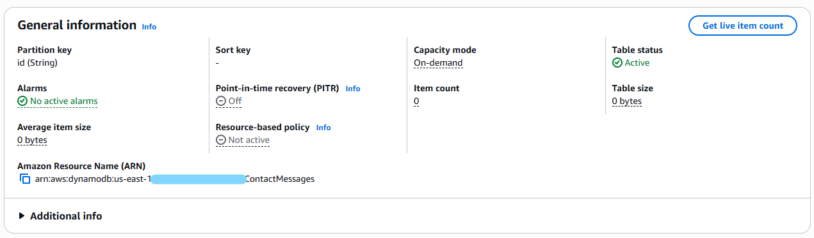
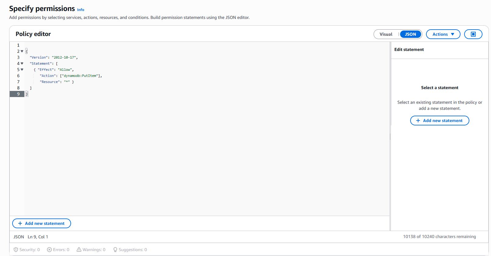
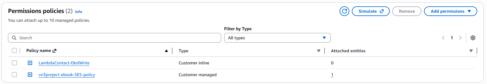

### IMPORTANTE: Esse projeto foi desenvolvido em um ambiente controlado com fins pedagógicos e de auto aprendizado. Esse projeto não passou por critérios de segurança ou autenticação. Usar isso em um ambiente de produção real pode expor a empresa a vulnerabilidades no sistema e causar consequências financeiras e legais de acordo com a Lei Geral de Proteção de Dados e o Marco Civil da Internet. Esse projeto não deve ser reproduzido em um ambiente profissional sem antes passar por uma validação minuciosa de segurança e boas práticas

## Seção 03 - Configurando DynamoDB

Vou começar criando a table. Para isso usei o AWS CLI:

`aws dynamodb create-table --table-name ContactMessages --attribute-definitions AttributeName=id,AttributeType=S --key-schema AttributeName=id,KeyType=HASH --billing-mode PAY_PER_REQUEST --region us-east-1`



Quando fiz a policy para o Lambda usar, não incluí o uma permissão para o DynamoDB. Nesse caso, vou precisar editar a permissão que ja tenho ou criar uma nova. Para fins educativos, decidi criar uma inline policy na role do Lambda:



```
{
  "Version": "2012-10-17",
  "Statement": [
    { "Effect": "Allow", 
       "Action": ["dynamodb:PutItem"], 
       "Resource": "*" }
  ]
}
```

