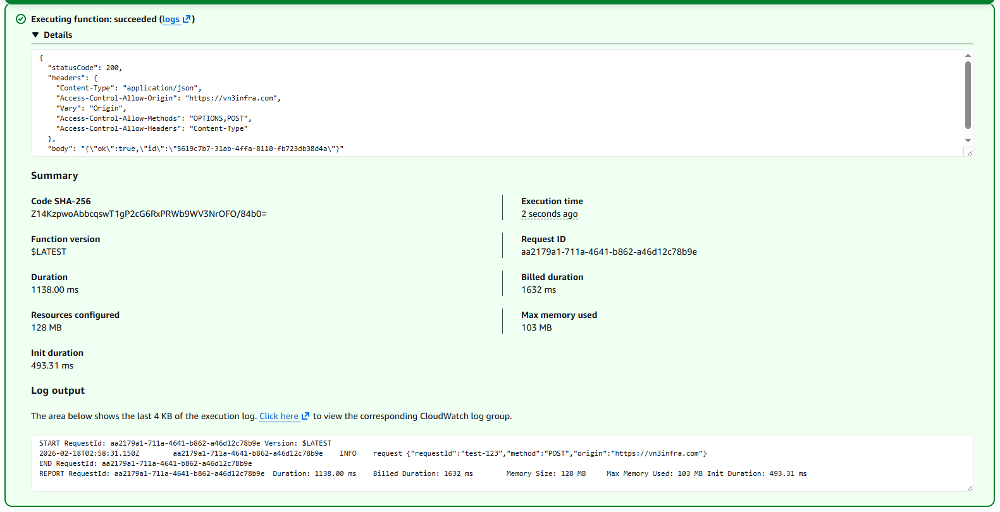
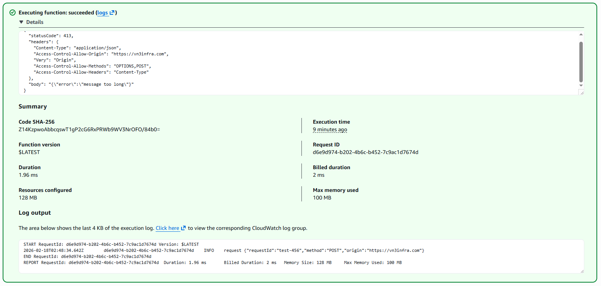
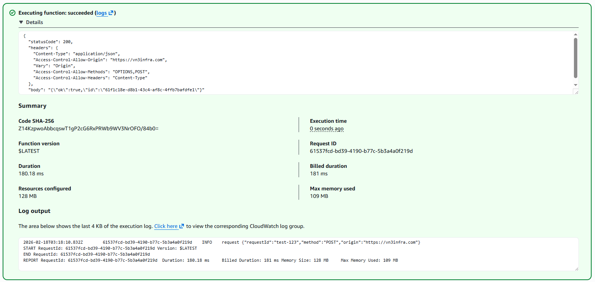
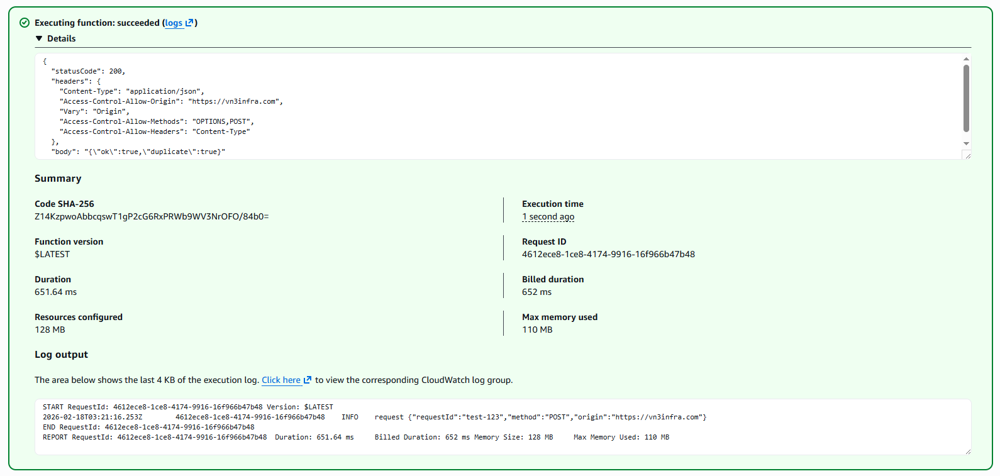
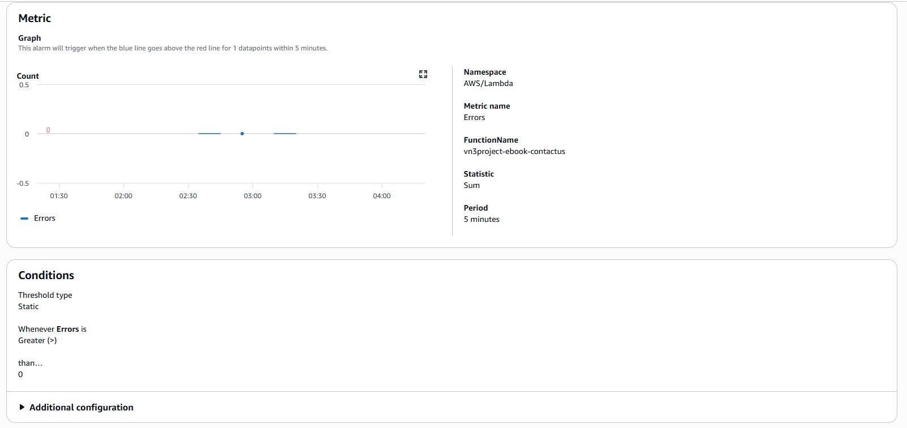
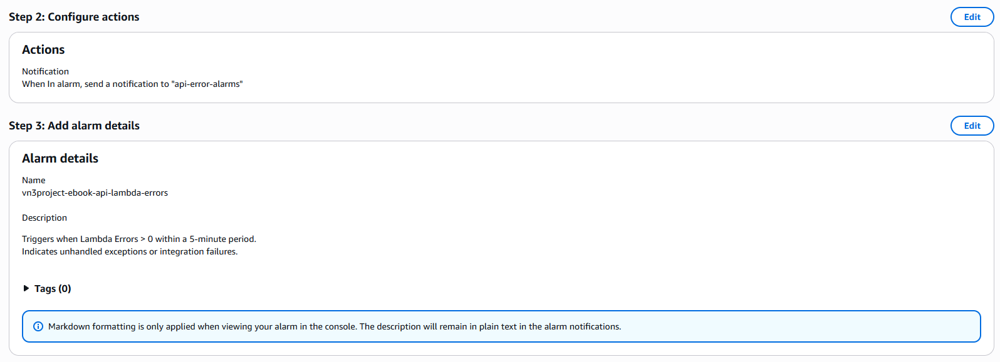
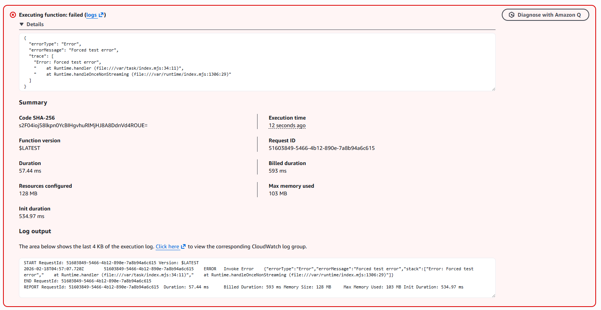
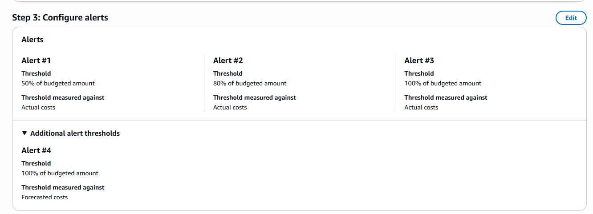
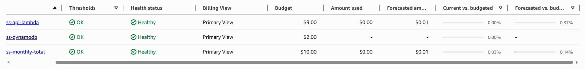

[🇧🇷 Versão em Português](#-versão-em-português)

### IMPORTANT: This project was developed in a controlled environment for educational and self-learning purposes. This project did not go through security or authentication criteria. Using this in a real production environment may expose the company to system vulnerabilities and cause financial and legal consequences in accordance with the General Data Protection Law (Lei Geral de Proteção de Dados) and the Brazilian Civil Rights Framework for the Internet (Marco Civil da Internet). This project must not be reproduced in a professional environment without first undergoing a thorough security validation and best practices review.

## In this section:
- [Logs without PII (CloudWatch)](#logs-without-pii-cloudwatch)
- [Masked email in SES](#masked-email-in-ses)
- [Restricted CORS in Lambda](#restricted-cors-in-lambda)
- [Input validation + sanitization](#input-validation--sanitization)
- [Payload limit + robust parsing](#payload-limit--robust-parsing)
- [API Gateway throttling](#api-gateway-throttling)
- [Fail-fast with environment variables](#fail-fast-with-environment-variables)
- [Anti-spam with dedupe + conditional write](#anti-spam-with-dedupe--conditional-write)
- [IAM least privilege (restricted resources)](#iam-least-privilege-restricted-resources)
- [Alarms (CloudWatch + SNS)](#alarms-cloudwatch--sns)
- [Budgets and cost alerts](#budgets-and-cost-alerts)
- [90-day TTL in DynamoDB](#90-day-ttl-in-dynamodb)

## Section 04 - Implementing security improvements and best practices


### Logs without PII (CloudWatch)

I started by making a small change to how logs were recorded in CloudWatch. Previously, logs contained bodies with data such as name and email. However, for observability purposes, this is not necessary.

Additionally, in Brazil, the country where I live, we have strict laws regarding the storage of personal data. Storing this information in a monitoring environment that is difficult to govern may expose the company to data leaks, fines, and other security incidents.

To address this and prevent future issues, logs now record only id, method, and origin from Lambda:

```ts
const requestId = event?.requestContext?.requestId;
const method = event?.httpMethod;
const origin = event?.headers?.origin || event?.headers?.Origin || "";

console.log("request", JSON.stringify({ requestId, method, origin }));
```

Old log:


New log:


Anonymized data without information considered personal data or identifiers.


### Masked email in SES

Continuing with data protection improvements, I also decided to change how the business owner receives emails from SES. Previously, the owner had explicit access to personal information: the user's email address. In this new version, the owner receives a masked email.

The owner still receives the submission ID for that user and can look it up in the database. The goal of this change is to minimize impact and data exposure in case the business owner’s email account is compromised. This creates an additional protection layer, where an attacker would also need database access to read sensitive data.

In Lambda, I created a function to mask the email before sending:

```ts
function maskEmail(email) {
  if (!email || typeof email !== "string") return "";
  const parts = email.trim().split("@");
  if (parts.length !== 2) return email;

  const [user, domain] = parts;
  if (!user) return `*@${domain}`;
  if (user.length === 1) return `${user}***@${domain}`;

  return `${user[0]}***@${domain}`;
}
```

New const to store the masked email:

`const emailMasked = maskEmail(email);`

Also changed it in the email body:

`Email: ${emailMasked}`

Old email:


New email:


### Restricted CORS in Lambda

I enabled Lambda proxy integration in API Gateway, transferring CORS responsibility to Lambda. In Lambda, I specified which origins are valid and modified corsHeaders(event) to validate the origin:

```ts
const ALLOWED_ORIGINS = new Set([
  "https://vn3infra.com",
  "https://www.vn3infra.com",
]);
```

```ts
function corsHeaders(event) {
  const origin = event?.headers?.origin || event?.headers?.Origin || "";
  const allowOrigin = ALLOWED_ORIGINS.has(origin) ? origin : "null";

  return {
    "Content-Type": "application/json",
    "Access-Control-Allow-Origin": allowOrigin,
    "Vary": "Origin",
    "Access-Control-Allow-Methods": "OPTIONS,POST",
    "Access-Control-Allow-Headers": "Content-Type",
  };
}
```

Attempting to fetch my API from another origin:


### Input validation + sanitization

To prevent some abuse of user input, I defined limits for the data the user can submit:

```ts
const LIMITS = {
  name: 100,
  email: 254,
  phone: 30,
  message: 1000,
};
```

```ts
function sanitize(value, maxLen) {
  if (value === undefined || value === null) return "";
  const str = String(value).trim();
  if (!str) return "";
  return str.length > maxLen ? str.slice(0, maxLen) : str;
}
```

```ts
const name = sanitize(body?.name, LIMITS.name);
const email = sanitize(body?.email, LIMITS.email).toLowerCase();
const phone = sanitize(body?.phone, LIMITS.phone);
const message = sanitize(body?.message, LIMITS.message);
```

```ts
if (!EMAIL_RE.test(email)) {
  return {
    statusCode: 400,
    headers: corsHeaders(event),
    body: JSON.stringify({ error: "invalid email format" }),
  };
}
```

Even if the user submits more characters than allowed, the database only stores up to the defined maximum.


### Payload limit + robust parsing

To prevent excessively large payloads from flooding the database, a change was made to the Lambda code to return 413 when the request body exceeds 2000 characters.

First, I added a constant to define the limit:

`const MAX_BODY_CHARS = 2000;`

I then replaced the body parsing logic with a more robust function that:
  - Validates isBase64Encoded
  - Returns 413 when the payload exceeds MAX_BODY_CHARS
  - Returns 400 for invalid JSON
  - Ensures the handler always works with a proper object

```ts
function parseJsonBody(event, maxChars) {
  const raw = event?.body;

  if (!raw) {
    return { ok: true, data: {}, rawLength: 0 };
  }

  // If it already comes as an object (rare, but possible), attempt to measure and accept
  if (typeof raw !== "string") {
    try {
      const asString = JSON.stringify(raw);
      if (asString.length > maxChars) {
        return { ok: false, statusCode: 413, error: "message too long" };
      }
      if (raw && typeof raw === "object") {
        return { ok: true, data: raw, rawLength: asString.length };
      }
      return { ok: true, data: {}, rawLength: asString.length };
    } catch {
      return { ok: false, statusCode: 400, error: "invalid request body" };
    }
  }

  // Body string: decode if base64 encoded
  let text = raw;
  if (event?.isBase64Encoded === true) {
    try {
      text = Buffer.from(raw, "base64").toString("utf8");
    } catch {
      return { ok: false, statusCode: 400, error: "invalid base64 body" };
    }
  }

  // Raw text length limit (pre-parse)
  if (text.length > maxChars) {
    return { ok: false, statusCode: 413, error: "message too long" };
  }

  // Parse JSON
  try {
    const data = JSON.parse(text);
    if (data && typeof data === "object") {
      return { ok: true, data, rawLength: text.length };
    }
    return { ok: true, data: {}, rawLength: text.length };
  } catch {
    return { ok: false, statusCode: 400, error: "invalid JSON" };
  }
}
```

I updated the handler to use the new parsing logic and enforce the limit:

```ts
const parsed = parseJsonBody(event, MAX_BODY_CHARS);
if (!parsed.ok) {
  return {
    statusCode: parsed.statusCode,
    headers: corsHeaders(event),
    body: JSON.stringify({ error: parsed.error }),
  };
}

const body = parsed.data;
```

I tested the implementation using payloads of different sizes (I temporarily changed `MAX_BODY_CHARS` to 100 for testing purposes).

Test with small payload:



Test with large payload:




### API Gateway throttling

I also enabled throttling in the API Gateway settings and defined the rate limit as 10 and burst as 20.


### Fail-fast with environment variables

Additionally, I configured environment variables in Lambda to store the emails and the DynamoDB table name. If a variable is empty, Lambda does not execute and returns 500. If all variables are validated, it returns 200 and executes normally.


In the Lambda code, I defined the environment variables:

```ts
const REGION = mustEnv("AWS_REGION");
const TABLE_NAME = mustEnv("TABLE_NAME");
const RECEIVER = mustEnv("RECEIVER_EMAIL");
const SENDER = mustEnv("SENDER_EMAIL");
```

Clients are created only after validation:

```ts
const ses = new SESClient({ region: REGION });
const ddb = DynamoDBDocumentClient.from(new DynamoDBClient({ region: REGION }));
```

Fail-fast: if an environment variable is missing, it does not attempt to process the request:

```ts
const envCheck = validateRuntimeConfig();
if (!envCheck.ok) {
  console.error("config_error", envCheck);
  return {
    statusCode: 500,
    headers: corsHeaders(event),
    body: JSON.stringify({
      error: "Service misconfigured",
      missing: envCheck.missing,
    }),
  };
}
```

```ts
function validateRuntimeConfig() {
  const required = {
    AWS_REGION: REGION,
    TABLE_NAME,
    RECEIVER_EMAIL: RECEIVER,
    SENDER_EMAIL: SENDER,
  };

  const missing = Object.entries(required)
    .filter(([, v]) => !v)
    .map(([k]) => k);

  return { ok: missing.length === 0, missing };
}
```


### Anti-spam with dedupe + conditional write

After that, I made additional changes to prevent spam

I created a dedupeKey and assigned it as the table’s primary key. If a user attempts to submit the same email on the same day, the record will not be saved in DynamoDB, nor will it trigger an email notification to the business owner:

```ts
const day = ts.slice(0, 10);
const dedupeKey = sha256(`${email}|${message}|${day}`);

id = dedupeKey // id in the table
```

Finally, I added protection to the PutCommand:

`ConditionExpression: "attribute_not_exists(id)"`

This ensures that the write operation only succeeds if the item does not already exist:






### IAM least privilege (restricted resources)

Finally, I restricted the Resource fields in the IAM policies attached to the Lambda roles. Previously, the JSON used "*" as the resource. Now, I have limited each policy to the correct scope for its respective service.

```json
{
  "Version": "2012-10-17",
  "Statement": [
    {
      "Sid": "CloudWatchLogsBasic",
      "Effect": "Allow",
      "Action": [
        "logs:CreateLogGroup"
      ],
      "Resource": "arn:aws:logs:xx-xxxx-x:xxxxxxxxxxxx:*"
    },
    {
      "Sid": "CloudWatchLogsStreamEvents",
      "Effect": "Allow",
      "Action": [
        "logs:CreateLogStream",
        "logs:PutLogEvents"
      ],
      "Resource": "arn:aws:logs:xx-xxxx-x:xxxxxxxxxxxx:log-group:/aws/lambda/xxxxxxxxxxxxxxxxxxxxxxxx:*"
    },
    {
      "Sid": "AllowSesSendEmail",
      "Effect": "Allow",
      "Action": [
        "ses:SendEmail",
        "ses:SendRawEmail"
      ],
      "Resource": [
        "arn:aws:ses:xx-xxxx-x:xxxxxxxxxxxx:identity/xxxxxxxxxxxxxxxxxxxx@xxxxxxxx.xxx",
        "arn:aws:ses:xx-xxxx-x:xxxxxxxxxxxx:identity/xxxxxxxxxxxxxxxx@xxxxxxxx.xxx"
      ]
    }
  ]
}
```

```json
{
  "Version": "2012-10-17",
  "Statement": [
    {
      "Sid": "AllowDynamoDBPutItem",
      "Effect": "Allow",
      "Action": [
        "dynamodb:PutItem"
      ],
      "Resource": "arn:aws:dynamodb:xx-xxxx-x:xxxxxxxxxxxx:table/xxxxxxxxxxxxxxxxxxxx"
    }
  ]
}
```


### Alarms (CloudWatch + SNS)

After that, I created a CloudWatch alarm to notify me whenever the API fails:





I created an SNS subscription using my primary email address and simulated tests by forcing an error:



Within a few seconds, I received an email notification indicating that the API had failed:


### Budgets and cost alerts

I created 3 alerts in Billing and Cost Management. This time, I configured notifications to trigger when overall costs, API Gateway/Lambda costs, and DynamoDB costs reach 50%, 80%, and 100% of the defined budget.  

I also configured alerts to trigger when the forecasted cost for each service is expected to exceed the budget.






### 90-day TTL in DynamoDB

Back to the Lambda code, I added a TTL set to 90 days. This helps prevent database cost accumulation and reduces potential compliance risks related to LGPD (Brazilian General Data Protection Law).

I added a constant to make the expiration period easy to adjust:

`const ttl = Math.floor(Date.now() / 1000) + (90 * 24 * 60 * 60);`

Then, in the PutCommand:

```ts
Item: {
  id,
  name,
  phone,
  email,
  message,
  createdAt: ts,
  expiresAt: ttl
}
```

---

# 🇧🇷 Versão em Português

### IMPORTANTE: Esse projeto foi desenvolvido em um ambiente controlado com fins pedagógicos e de auto aprendizado. Esse projeto não passou por critérios de segurança ou autenticação. Usar isso em um ambiente de produção real pode expor a empresa a vulnerabilidades no sistema e causar consequências financeiras e legais de acordo com a Lei Geral de Proteção de Dados e o Marco Civil da Internet. Esse projeto não deve ser reproduzido em um ambiente profissional sem antes passar por uma validação minuciosa de segurança e boas práticas

## Nessa seção:
- [Logs sem PII (CloudWatch)](#logs-sem-pii-no-cloudwatch)
- [E-mail mascarado no SES](#e-mail-mascarado-no-ses)
- [CORS restrito no Lambda](#cors-restrito-no-lambda)
- [Validação + sanitização de input](#validação--sanitização-de-input)
- [Limite de payload + parsing robusto](#limite-de-payload--parsing-robusto)
- [Throttling no API Gateway](#throttling-no-api-gateway)
- [Fail-fast com variáveis de ambiente](#fail-fast-com-variáveis-de-ambiente)
- [Anti-spam com dedupe + escrita condicional](#anti-spam-com-dedupe--escrita-condicional)
- [IAM least privilege (resources restritos)](#iam-least-privilege-resources-restritos)
- [Alarmes (CloudWatch + SNS)](#alarmes-cloudwatch--sns)
- [Budgets e alertas de custo](#budgets-e-alertas-de-custo)
- [TTL de 90 dias no DynamoDB](#ttl-de-90-dias-no-dynamodb)

## Seção 04 - Implementando melhorias de segurança e boas prática


### Logs sem PII no CloudWatch

Comecei fazendo uma pequena alteração em como os logs eram registrados no CloudWatch. Anteriormente, os logs continham bodies com dados como nome e email. Mas para a finalidade de observabilidade isso não é necessário. 

Além disso, no Brasil, país em que eu moro, temos leis rigorosas sobre armazenamento de dados pessoais. Armazenar essas informações em um ambiente de monitoramento dificil de governar pode expor a empresa a vazamentos, multas e outros incidentes de segurança.

Para resolver isso e evitar problemas futuros, os logs agora registram apenas id, método e origem pelo Lambda:

```ts
const requestId = event?.requestContext?.requestId;
const method = event?.httpMethod;
const origin = event?.headers?.origin || event?.headers?.Origin || "";

console.log("request", JSON.stringify({ requestId, method, origin }));
```

Log antigo:


Log novo:


Dados anonimizados sem informações consideradas dados pessoais ou identificadores


### E-mail mascarado no SES

Aproveitando o embalo da proteção de dados, também decidi fazer uma mudança em como o dono do negócio vai receber o e-mail do SES. Anteriormente, o dono tinha acesso explicito a informações consideradas pessoais: O email do usuário. Nessa nova versão, o dono recebe um email censurado

O dono ainda recebe o ID da submissão daquele usuário e pode consultar isso no banco de dados. O objetivo dessa mudança é minimizar impactos e vazamentos caso o dono do negócio tenha o e-mail invadido. Isso cria uma camada a mais de proteção, onde o invasor precisaria ter o acesso ao banco de dados para ler os dados sensíveis

No Lambda, criei uma function para mascarar o email antes de enviar:

```ts
function maskEmail(email) {
  if (!email || typeof email !== "string") return "";
  const parts = email.trim().split("@");
  if (parts.length !== 2) return email;

  const [user, domain] = parts;
  if (!user) return `*@${domain}`;
  if (user.length === 1) return `${user}***@${domain}`;

  return `${user[0]}***@${domain}`;
}
```

Nova const para armazenar o email mascarado:

`const emailMasked = maskEmail(email);`

Alterar logo a baixo no email também:

`Email: ${emailMasked}`

Email antigo:


Email novo:


### CORS restrito no Lambda

Ativei o lambda proxy integrations no API Gateway, passando a responsabilidade do CORS para o Lambda. No Lambda, especifiquei quais origins são válidas e alterei corsHeaders(event) para validar a origin:

```ts
const ALLOWED_ORIGINS = new Set([
  "https://vn3infra.com",
  "https://www.vn3infra.com",
]);
```

```ts
function corsHeaders(event) {
  const origin = event?.headers?.origin || event?.headers?.Origin || "";
  const allowOrigin = ALLOWED_ORIGINS.has(origin) ? origin : "null";

  return {
    "Content-Type": "application/json",
    "Access-Control-Allow-Origin": allowOrigin,
    "Vary": "Origin",
    "Access-Control-Allow-Methods": "OPTIONS,POST",
    "Access-Control-Allow-Headers": "Content-Type",
  };
}
```

Ao tentar dar fetch com a minha API em um alguma outra origin:


### Validação + sanitização de input

Para evitar alguns abusos do input do usuário, defini alguns limites para os dados que o usuario pode inserir:

```ts
const LIMITS = {
  name: 100,
  email: 254,
  phone: 30,
  message: 1000,
};
```

```ts
function sanitize(value, maxLen) {
  if (value === undefined || value === null) return "";
  const str = String(value).trim();
  if (!str) return "";
  return str.length > maxLen ? str.slice(0, maxLen) : str;
}
```

```ts
const name = sanitize(body?.name, LIMITS.name);
const email = sanitize(body?.email, LIMITS.email).toLowerCase();
const phone = sanitize(body?.phone, LIMITS.phone);
const message = sanitize(body?.message, LIMITS.message);
```

```ts
if (!EMAIL_RE.test(email)) {
  return {
    statusCode: 400,
    headers: corsHeaders(event),
    body: JSON.stringify({ error: "invalid email format" }),
  };
}
```

Mesmo que o usuário coloque mais dos caracteres inseridos, o banco só registra até o max


### Limite de payload + parsing robusto

Para evitar payloads muito grandes e inundar o database. Foi feita uma alteração no Lambda code para retornar 413 caso o payload seja maior que 2000 caracteres. Primeiro, adicionei uma constante para o limite:

`const MAX_BODY_CHARS = 2000;`

Substituí o parsing do body por uma função robusta que:
  - Valida isBase64Encoded
  - Retorna 413 quando o payload excede MAX_BODY_CHARS
  - Retorna 400 para JSON inválido
  - Garante que o handler sempre trabalhe com um objeto

```ts
function parseJsonBody(event, maxChars) {
  const raw = event?.body;

  if (!raw) {
    return { ok: true, data: {}, rawLength: 0 };
  }

  // Se já vier como objeto (raro, mas possível), tenta medir e aceitar
  if (typeof raw !== "string") {
    try {
      const asString = JSON.stringify(raw);
      if (asString.length > maxChars) {
        return { ok: false, statusCode: 413, error: "message too long" };
      }
      if (raw && typeof raw === "object") {
        return { ok: true, data: raw, rawLength: asString.length };
      }
      return { ok: true, data: {}, rawLength: asString.length };
    } catch {
      return { ok: false, statusCode: 400, error: "invalid request body" };
    }
  }

  // body string: decodifica se vier base64
  let text = raw;
  if (event?.isBase64Encoded === true) {
    try {
      text = Buffer.from(raw, "base64").toString("utf8");
    } catch {
      return { ok: false, statusCode: 400, error: "invalid base64 body" };
    }
  }

  // limite no texto bruto (pré-parse)
  if (text.length > maxChars) {
    return { ok: false, statusCode: 413, error: "message too long" };
  }

  // parse JSON
  try {
    const data = JSON.parse(text);
    if (data && typeof data === "object") {
      return { ok: true, data, rawLength: text.length };
    }
    return { ok: true, data: {}, rawLength: text.length };
  } catch {
    return { ok: false, statusCode: 400, error: "invalid JSON" };
  }
}
```

Atualizei o handler para usar o novo parse + limite:

```ts
const parsed = parseJsonBody(event, MAX_BODY_CHARS);
if (!parsed.ok) {
  return {
    statusCode: parsed.statusCode,
    headers: corsHeaders(event),
    body: JSON.stringify({ error: parsed.error }),
  };
}

const body = parsed.data;
```

Testes usando payloads de tamanhos diferentes (Alterei o `MAX_BODY_CHARS` para 100, apenas para testar)

Teste com payload pequeno:


Teste com payload grande:


### Throttling no API Gateway

Também ativei o throttling nas configs do API Gateway e defini o rate limit para 10 e o burst para 20


### Fail-fast com variáveis de ambiente

Além disso, configurei variáveis de ambiente no Lambda para armazenar os e-mails e a table do Ddb. Se uma variável estiver vazia, o Lambda não executa e retorna 500. Se todas as variáveis forem validadas, ele retorna 200 e executa o Lambda normalmente.


No codigo Lambda, fiz as variáveis de ambiente:

```ts
const REGION = mustEnv("AWS_REGION");
const TABLE_NAME = mustEnv("TABLE_NAME");
const RECEIVER = mustEnv("RECEIVER_EMAIL");
const SENDER = mustEnv("SENDER_EMAIL");
```

Clients só depois de validar:

```ts
const ses = new SESClient({ region: REGION });
const ddb = DynamoDBDocumentClient.from(new DynamoDBClient({ region: REGION }));
```

Fail-fast. Se env estiver faltando, nem tenta processar request:

```ts
  const envCheck = validateRuntimeConfig();
  if (!envCheck.ok) {
    console.error("config_error", envCheck);
    return {
      statusCode: 500,
      headers: corsHeaders(event),
      body: JSON.stringify({
        error: "Service misconfigured",
        missing: envCheck.missing, // opcional: pode remover em prod
      }),
    };
  }
```

```ts
function validateRuntimeConfig() {
  const required = {
    AWS_REGION: REGION,
    TABLE_NAME,
    RECEIVER_EMAIL: RECEIVER,
    SENDER_EMAIL: SENDER,
  };

  const missing = Object.entries(required)
    .filter(([, v]) => !v)
    .map(([k]) => k);

  return { ok: missing.length === 0, missing };
}
```


### Anti-spam com dedupe + escrita condicional

Depois disso, fiz algumas mudanças para evitar spam

Criei um dedupeKey e atribui como a chave primária da tabela. Se um usuário tentar postar o mesmo email no mesmo dia, não será gravado no ddb e nem enviado para o email do dono do negócio:

```ts
const day = ts.slice(0, 10);
const dedupeKey = sha256(`${email}|${message}|${day}`);

id = dedupeKey // id na table
```

Por fim, adicionei proteção no PutCommand:

`ConditionExpression: "attribute_not_exists(id)"`

Isso garante que a operação só vai funcionar se o item ja não existir:


### IAM least privilege (resources restritos)

Por fim, restringi os resources das policies nas roles do Lambda. Anteriormente json tinha * como resource. Agora, restringi para o escopo correto de cada serviço:

```json
{
  "Version": "2012-10-17",
  "Statement": [
    {
      "Sid": "CloudWatchLogsBasic",
      "Effect": "Allow",
      "Action": [
        "logs:CreateLogGroup"
      ],
      "Resource": "arn:aws:logs:xx-xxxx-x:xxxxxxxxxxxx:*"
    },
    {
      "Sid": "CloudWatchLogsStreamEvents",
      "Effect": "Allow",
      "Action": [
        "logs:CreateLogStream",
        "logs:PutLogEvents"
      ],
      "Resource": "arn:aws:logs:xx-xxxx-x:xxxxxxxxxxxx:log-group:/aws/lambda/xxxxxxxxxxxxxxxxxxxxxxxx:*"
    },
    {
      "Sid": "AllowSesSendEmail",
      "Effect": "Allow",
      "Action": [
        "ses:SendEmail",
        "ses:SendRawEmail"
      ],
      "Resource": [
        "arn:aws:ses:xx-xxxx-x:xxxxxxxxxxxx:identity/xxxxxxxxxxxxxxxxxxxx@xxxxxxxx.xxx",
        "arn:aws:ses:xx-xxxx-x:xxxxxxxxxxxx:identity/xxxxxxxxxxxxxxxx@xxxxxxxx.xxx"
      ]
    }
  ]
}
```

```json
{
  "Version": "2012-10-17",
  "Statement": [
    {
      "Sid": "AllowDynamoDBPutItem",
      "Effect": "Allow",
      "Action": [
        "dynamodb:PutItem"
      ],
      "Resource": "arn:aws:dynamodb:xx-xxxx-x:xxxxxxxxxxxx:table/xxxxxxxxxxxxxxxxxxxx"
    }
  ]
}
```


### Alarmes (CloudWatch + SNS)

Depois disso, ciei um alarme no CloudWatch para avisar quando a API falhar:


Criei uma subscription no SNS usando o e-mail principal e simulei os testes forçando um erro:


Em alguns segundos, recebi o e-mail informando que a API falhou:


### Budgets e alertas de custo

Criei 3 alertas. Dessa vez, no Billing and Cost Management para disparar um aviso quando os custos gerais, do API Gateway/Lambda, e do DynamoDB atingirem 50%, 80%, 100% do budget. E também, para quando forecast de cada serviço for estourar o budget:


### TTL de 90 dias no DynamoDB

De volta ao código Lambda, adicionei um TTL para 90 dias. Isso evita acumulo de custos no database e evita problemas com a LGPD (Lei Geral de Proteção de Dados Pessoais)

Adicionei uma const, facil de alterar o tempo de expiração:

`const ttl = Math.floor(Date.now() / 1000) + (90 * 24 * 60 * 60);`

Depois no PutCommand:

```ts
Item: {
  id,
  name,
  phone,
  email,
  message,
  createdAt: ts,
  expiresAt: ttl
}
```