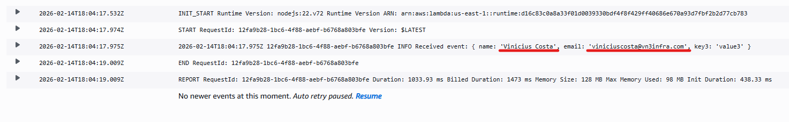
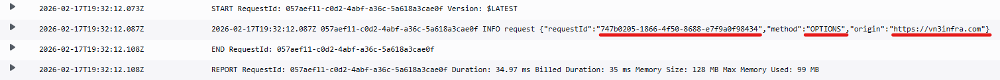
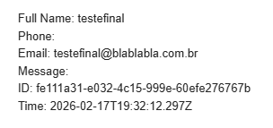
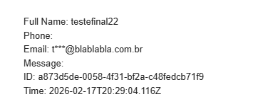
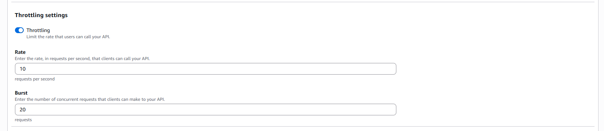
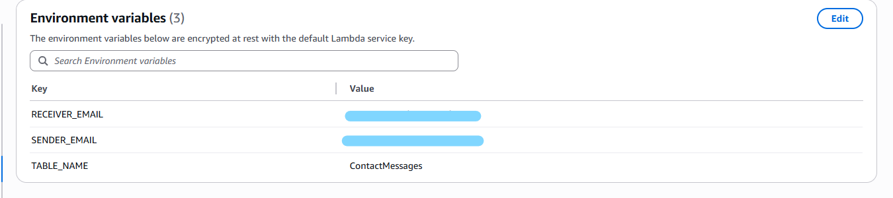

[🇧🇷 Versão em Português](#versao-em-portugues)

### IMPORTANT: This project was developed in a controlled environment for educational and self-learning purposes. This project did not go through security or authentication criteria. Using this in a real production environment may expose the company to system vulnerabilities and cause financial and legal consequences in accordance with the General Data Protection Law (Lei Geral de Proteção de Dados) and the Brazilian Civil Rights Framework for the Internet (Marco Civil da Internet). This project must not be reproduced in a professional environment without first undergoing a thorough security validation and best practices review.

## In this section:
- I removed PII from CloudWatch logs (only requestId, method, and origin)
- I masked the user email in SES notifications to reduce exposure if the business inbox is compromised
- I tightened CORS by allowing only my domains (moved CORS handling to Lambda via proxy integration)
- I added input limits + sanitization and validated email format to reduce abuse
- I blocked oversized payloads (413 when body > 2000 chars) and enabled API Gateway throttling (rate 10 / burst 20)
- I moved critical config to Lambda environment variables and added fail-fast validation when variables are missing

## Section 04 - Implementing security improvements and best practices

I started by making a small change to how logs were recorded in CloudWatch. Previously, logs contained bodies with data such as name and email. However, for observability purposes, this is not necessary.

Additionally, in Brazil, the country where I live, we have strict laws regarding the storage of personal data. Storing this information in a monitoring environment that is difficult to govern may expose the company to data leaks, fines, and other security incidents.

To address this and prevent future issues, logs now record only id, method, and origin from Lambda:

```ts
const requestId = event?.requestContext?.requestId;
const method = event?.httpMethod;
const origin = event?.headers?.origin || event?.headers?.Origin || "";

console.log("request", JSON.stringify({ requestId, method, origin }));
```

Old log:



New log:



Anonymized data without information considered personal data or identifiers.

Continuing with data protection improvements, I also decided to change how the business owner receives emails from SES. Previously, the owner had explicit access to personal information: the user's email address. In this new version, the owner receives a masked email.

The owner still receives the submission ID for that user and can look it up in the database. The goal of this change is to minimize impact and data exposure in case the business owner’s email account is compromised. This creates an additional protection layer, where an attacker would also need database access to read sensitive data.

In Lambda, I created a function to mask the email before sending:

```ts
function maskEmail(email) {
  if (!email || typeof email !== "string") return "";
  const parts = email.trim().split("@");
  if (parts.length !== 2) return email;

  const [user, domain] = parts;
  if (!user) return `*@${domain}`;
  if (user.length === 1) return `${user}***@${domain}`;

  return `${user[0]}***@${domain}`;
}
```

New const to store the masked email:

`const emailMasked = maskEmail(email);`

Also changed it in the email body:

`Email: ${emailMasked}`

Old email:



New email:



Now regarding CORS, the code previously allowed any origin to call my API. This allows other websites to use the API and read responses. To fix this, I enabled Lambda proxy integration in API Gateway, transferring CORS responsibility to Lambda. In Lambda, I specified which origins are valid and modified corsHeaders(event) to validate the origin.

In Lambda:

```ts
const ALLOWED_ORIGINS = new Set([
  "https://vn3infra.com",
  "https://www.vn3infra.com",
]);
```

```ts
function corsHeaders(event) {
  const origin = event?.headers?.origin || event?.headers?.Origin || "";
  const allowOrigin = ALLOWED_ORIGINS.has(origin) ? origin : "null";

  return {
    "Content-Type": "application/json",
    "Access-Control-Allow-Origin": allowOrigin,
    "Vary": "Origin",
    "Access-Control-Allow-Methods": "OPTIONS,POST",
    "Access-Control-Allow-Headers": "Content-Type",
  };
}
```

Attempting to fetch my API from another origin:


To prevent some abuse of user input, I defined limits for the data the user can submit:

```ts
const LIMITS = {
  name: 100,
  email: 254,
  phone: 30,
  message: 1000,
};
```

```ts
function sanitize(value, maxLen) {
  if (value === undefined || value === null) return "";
  const str = String(value).trim();
  if (!str) return "";
  return str.length > maxLen ? str.slice(0, maxLen) : str;
}
```

```ts
const name = sanitize(body?.name, LIMITS.name);
const email = sanitize(body?.email, LIMITS.email).toLowerCase();
const phone = sanitize(body?.phone, LIMITS.phone);
const message = sanitize(body?.message, LIMITS.message);
```

```ts
if (!EMAIL_RE.test(email)) {
  return {
    statusCode: 400,
    headers: corsHeaders(event),
    body: JSON.stringify({ error: "invalid email format" }),
  };
}
```

Even if the user submits more characters than allowed, the database only stores up to the defined maximum.

To prevent very large payloads from overwhelming the database, I updated the Lambda code to return 413 if the payload exceeds 2000 characters:

```ts
if (body.length > 2000) return {
    statusCode: 413,
    headers: corsHeaders(event),
    body: JSON.stringify({ error: "message too long" }),
}
```

I also enabled throttling in the API Gateway settings and defined the rate limit as 10 and burst as 20.



Additionally, I configured environment variables in Lambda to store the emails and the DynamoDB table name. If a variable is empty, Lambda does not execute and returns 500. If all variables are validated, it returns 200 and executes normally.



In the Lambda code, I defined the environment variables:

```ts
const REGION = mustEnv("AWS_REGION");
const TABLE_NAME = mustEnv("TABLE_NAME");
const RECEIVER = mustEnv("RECEIVER_EMAIL");
const SENDER = mustEnv("SENDER_EMAIL");
```

Clients are created only after validation:

```ts
const ses = new SESClient({ region: REGION });
const ddb = DynamoDBDocumentClient.from(new DynamoDBClient({ region: REGION }));
```

Fail-fast: if an environment variable is missing, it does not attempt to process the request:

```ts
const envCheck = validateRuntimeConfig();
if (!envCheck.ok) {
  console.error("config_error", envCheck);
  return {
    statusCode: 500,
    headers: corsHeaders(event),
    body: JSON.stringify({
      error: "Service misconfigured",
      missing: envCheck.missing,
    }),
  };
}
```

```ts
function validateRuntimeConfig() {
  const required = {
    AWS_REGION: REGION,
    TABLE_NAME,
    RECEIVER_EMAIL: RECEIVER,
    SENDER_EMAIL: SENDER,
  };

  const missing = Object.entries(required)
    .filter(([, v]) => !v)
    .map(([k]) => k);

  return { ok: missing.length === 0, missing };
}
```

I recognize that using AWS WAF would be easier and more efficient. However, since I am on the free tier and this is only a learning lab, I chose to keep the project cost-free.

---

# 🇧🇷 Versão em Português

### IMPORTANTE: Esse projeto foi desenvolvido em um ambiente controlado com fins pedagógicos e de auto aprendizado. Esse projeto não passou por critérios de segurança ou autenticação. Usar isso em um ambiente de produção real pode expor a empresa a vulnerabilidades no sistema e causar consequências financeiras e legais de acordo com a Lei Geral de Proteção de Dados e o Marco Civil da Internet. Esse projeto não deve ser reproduzido em um ambiente profissional sem antes passar por uma validação minuciosa de segurança e boas práticas

## Nessa seção:
- Removi dados pessoais (PII) dos logs do CloudWatch (agora apenas requestId, method e origin)
- Masquei o e-mail do usuário nas notificações do SES para reduzir a exposição caso a caixa de e-mail do negócio seja comprometida
- Restrigi o CORS permitindo apenas meus domínios (movendo o tratamento de CORS para o Lambda via proxy integration)
- Adicionei limites de entrada + sanitização e validei o formato do e-mail para reduzir abusos
- Bloqueei payloads muito grandes (413 quando body > 2000 caracteres) e ativei throttling no API Gateway (rate 10 / burst 20)
- Mudei configurações críticas para variáveis de ambiente no Lambda e adicionei validação fail-fast quando variáveis estiverem ausentes

## Seção 04 - Implementando melhorias de segurança e boas prática

Comecei fazendo uma pequena alteração em como os logs eram registrados no CloudWatch. Anteriormente, os logs continham bodies com dados como nome e email. Mas para a finalidade de observabilidade isso não é necessário. 

Além disso, no Brasil, país em que eu moro, temos leis rigorosas sobre armazenamento de dados pessoais. Armazenar essas informações em um ambiente de monitoramento dificil de governar pode expor a empresa a vazamentos, multas e outros incidentes de segurança.

Para resolver isso e evitar problemas futuros, os logs agora registram apenas id, método e origem pelo Lambda:

```ts
const requestId = event?.requestContext?.requestId;
const method = event?.httpMethod;
const origin = event?.headers?.origin || event?.headers?.Origin || "";

console.log("request", JSON.stringify({ requestId, method, origin }));
```

Log antigo:


Log novo:


Dados anonimizados sem informações consideradas dados pessoais ou identificadores

Aproveitando o embalo da proteção de dados, também decidi fazer uma mudança em como o dono do negócio vai receber o e-mail do SES. Anteriormente, o dono tinha acesso explicito a informações consideradas pessoais: O email do usuário. Nessa nova versão, o dono recebe um email censurado

O dono ainda recebe o ID da submissão daquele usuário e pode consultar isso no banco de dados. O objetivo dessa mudança é minimizar impactos e vazamentos caso o dono do negócio tenha o e-mail invadido. Isso cria uma camada a mais de proteção, onde o invasor precisaria ter o acesso ao banco de dados para ler os dados sensíveis

No Lambda, criei uma function para mascarar o email antes de enviar:

```ts
function maskEmail(email) {
  if (!email || typeof email !== "string") return "";
  const parts = email.trim().split("@");
  if (parts.length !== 2) return email;

  const [user, domain] = parts;
  if (!user) return `*@${domain}`;
  if (user.length === 1) return `${user}***@${domain}`;

  return `${user[0]}***@${domain}`;
}
```

Nova const para armazenar o email mascarado:

`const emailMasked = maskEmail(email);`

Alterar logo a baixo no email também:

`Email: ${emailMasked}`

Email antigo:


Email novo:


Agora sobre CORS, o código permitia qualquer origin chamar a minha API. Isso permite que outros sites usem a API e leiam as respostas. Para corrigir isso, ativei o lambda proxy integrations no API Gateway, passando a responsabilidade do CORS para o Lambda. No Lambda, especifiquei quais origins são válidas e alterei corsHeaders(event) para validar a origin

No Lambda:

```ts
const ALLOWED_ORIGINS = new Set([
  "https://vn3infra.com",
  "https://www.vn3infra.com",
]);
```

```ts
function corsHeaders(event) {
  const origin = event?.headers?.origin || event?.headers?.Origin || "";
  const allowOrigin = ALLOWED_ORIGINS.has(origin) ? origin : "null";

  return {
    "Content-Type": "application/json",
    "Access-Control-Allow-Origin": allowOrigin,
    "Vary": "Origin",
    "Access-Control-Allow-Methods": "OPTIONS,POST",
    "Access-Control-Allow-Headers": "Content-Type",
  };
}
```

Ao tentar dar fetch com a minha API em um alguma outra origin:


Para evitar alguns abusos do input do usuário, defini alguns limites para os dados que o usuario pode inserir:

```ts
const LIMITS = {
  name: 100,
  email: 254,
  phone: 30,
  message: 1000,
};
```

```ts
function sanitize(value, maxLen) {
  if (value === undefined || value === null) return "";
  const str = String(value).trim();
  if (!str) return "";
  return str.length > maxLen ? str.slice(0, maxLen) : str;
}
```

```ts
const name = sanitize(body?.name, LIMITS.name);
const email = sanitize(body?.email, LIMITS.email).toLowerCase();
const phone = sanitize(body?.phone, LIMITS.phone);
const message = sanitize(body?.message, LIMITS.message);
```

```ts
if (!EMAIL_RE.test(email)) {
  return {
    statusCode: 400,
    headers: corsHeaders(event),
    body: JSON.stringify({ error: "invalid email format" }),
  };
}
```

Mesmo que o usuário coloque mais dos caracteres inseridos, o banco só registra até o max

Para evitar payloads muito grandes e inundar o database. Foi feita uma alteração no Lambda code para retornar 413 caso o payload seja maior que 2000 caracteres:

```ts
if (body.length>2000) return {
    statusCode: 413,
    headers: corsHeaders(event),
    body: JSON.stringify({ error: "message too long" }),
}
```
Também ativei o throttling nas configs do API Gateway e defini o rate limit para 10 e o burst para 20


Além disso, configurei variáveis de ambiente no Lambda para armazenar os e-mails e a table do Ddb. Se uma variável estiver vazia, o Lambda não executa e retorna 500. Se todas as variáveis forem validadas, ele retorna 200 e executa o Lambda normalmente.


No codigo Lambda, fiz as variáveis de ambiente:

```ts
const REGION = mustEnv("AWS_REGION");
const TABLE_NAME = mustEnv("TABLE_NAME");
const RECEIVER = mustEnv("RECEIVER_EMAIL");
const SENDER = mustEnv("SENDER_EMAIL");
```

Clients só depois de validar:

```ts
const ses = new SESClient({ region: REGION });
const ddb = DynamoDBDocumentClient.from(new DynamoDBClient({ region: REGION }));
```

Fail-fast. Se env estiver faltando, nem tenta processar request:

```ts
  const envCheck = validateRuntimeConfig();
  if (!envCheck.ok) {
    console.error("config_error", envCheck);
    return {
      statusCode: 500,
      headers: corsHeaders(event),
      body: JSON.stringify({
        error: "Service misconfigured",
        missing: envCheck.missing, // opcional: pode remover em prod
      }),
    };
  }
```

```ts
function validateRuntimeConfig() {
  const required = {
    AWS_REGION: REGION,
    TABLE_NAME,
    RECEIVER_EMAIL: RECEIVER,
    SENDER_EMAIL: SENDER,
  };

  const missing = Object.entries(required)
    .filter(([, v]) => !v)
    .map(([k]) => k);

  return { ok: missing.length === 0, missing };
}
```

Reconheço que usar o WAF seria mais facil e eficiente. Mas como estou no free tier e esse é apenas um lab para aprendizado, optei por manter o projeto sem custos