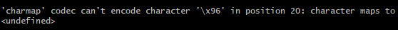

## 'charmap' codec can't encode character '\x96'

If, when configuring the AWS access keys in Git Bash, you encounter the error:
`'charmap' codec can't encode character '\x96'`
It is a Windows terminal encoding issue (cp1252).

The terminal is probably using an old encoding. In that case, run:

`export PYTHONIOENCODING=utf-8`

Then, try running aws configure again.

--- 
🇧🇷

Se quando configurar as chaves de acesso da aws no git bash encontrar o erro:
`'charmap' codec can't encode character '\x96'`
É um problema de encoding do terminal do Windows (cp1252)

Provavelmente o terminal esta usando encoding antigo. Nesse caso, rode:

`export PYTHONIOENCODING=utf-8`

Depois, tente rodar `aws configure` novamente

## InvalidAccessKeyId

`An error occurred (InvalidAccessKeyId) when calling the ListBuckets operation: The AWS Access Key Id you provided does not exist in our records`

It means that the Access Key ID configured in your AWS CLI is invalid or no longer exists in AWS

Check if `aws configure` is correct. If you have other profiles, you need to specify the profile after the command:

`aws s3 ls --profile profile-name`
`aws s3 mb s3://bucket-name --profile profile-name`

---
🇧🇷

Significa que a Access Key ID configurada na sua AWS CLI é invalida ou não existe mais na AWS

Verifique se o `aws configure` esta correto. Se você tiver outros profiles você precisa especificar o perfil depois do comando:

`aws s3 ls --profile nome-do-profile`
`aws s3 mb s3://nome-do-bucket --profile nome-do-profile`

## NoSuchBucket

`An error occurred (NoSuchBucket) when calling the PutBucketWebsite operation: The specified bucket does not exist`

It was not possible to find a bucket with that name

Probably:
    You are using another account / another profile in the AWS CLI
    You created the bucket in another region and your CLI is pointing to a different one
    Typo in the name

---
🇧🇷

Não foi possivel encontrar um bucket com esse nome

Provavelmente:
    Você está usando outra conta / outro profile no AWS CLI
    Você criou o bucket em outra região e seu CLI está apontando para outra
    Erro de digitação no nome